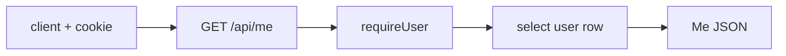

# routes.ts — AI component doc

> AI-facing sidecar for `routes.ts` (users module). Created 2026-07-06. Keep this in sync with the code on every change.

## Purpose
`GET /api/me` (plan Task 5): the authenticated user's identity + ledger-accurate credit balance, matching contracts `meSchema`.

## What it does (for an AI reader)
- Responsibilities: `requireUser` → select `{ id, email, name, creditsBalance }` fresh from the `user` table (not from the session payload, so the balance is never stale).
- Public API / exports: `registerUserRoutes(app, db)`.
- Inputs → Outputs: session cookie → `200 { id, email, name, creditsBalance }`; no session → `401 { error: { code: 'unauthorized' } }`; live cookie but deleted user → `404 not_found`.
- Side effects: none (read-only).

## Dependencies
- Imports / depends on: `drizzle-orm` (`eq`), `fastify` types, `db/client` (type), `db/schema` (`user`).
- Used by: `app.ts` (registration); consumed by the SPA's Auth module.

## Diagram

## Key decisions / gotchas
- Balance is read from the db on every call — it's the single source the SPA trusts after generate/refund flows.

## Commits
- 808e8e7 feat(api): better-auth (email+google) with signup bonus + /api/me
