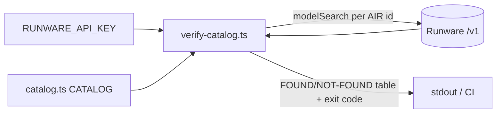

# verify-catalog.ts — manual AIR-id launch gate

> AI-facing sidecar for `verify-catalog.ts`. Created 2026-07-06. Keep this in sync with the code on every change.

## Purpose
Standalone operational script that confirms every `CATALOG` AIR id actually exists on Runware (via the `modelSearch` task) before launch. Research flagged `minimax:4@1` and `google:3@2` as unverified — this script is the gate for them.

## What it does (for an AI reader)
- Responsibilities: for each catalog entry, POST one `modelSearch` task with `search: <air>` and require an exact `air` match in results; print a FOUND/NOT-FOUND table.
- Public API / exports: none — top-level script, run manually with `tsx`.
- Inputs → Outputs: `RUNWARE_API_KEY` env (validated with Zod at the boundary) → stdout table; exit 0 if all FOUND, exit 1 if the key is missing or any model is NOT-FOUND/errored.
- Side effects (I/O, network, state): live HTTPS calls to `https://api.runware.ai/v1` (costs nothing — modelSearch is a metadata query); no DB, no writes.

## Dependencies
- Imports / depends on: `node:crypto` (randomUUID task ids), `zod`, `../modules/catalog/catalog` (`CATALOG`).
- Used by: humans/CI before launch — `RUNWARE_API_KEY=... pnpm --filter @opencreate/api exec tsx src/scripts/verify-catalog.ts`. Never imported by app code (top-level `process.exit` side effects).

## Diagram

## Key decisions / gotchas
- Deliberately does NOT use `loadConfig()`: that would demand the full app env (auth secret etc.) for a check that only needs the Runware key. A minimal Zod parse keeps boundary validation without the coupling.
- Requires an exact `air` match in `modelSearch` results so partial search hits can't produce a false FOUND.
- Uses raw `fetch`, not `integrations/runware/client.ts`: the client is shaped for inference tasks (imageInference/videoInference/getResponse), and the script must keep zero app-runtime dependencies.

## Commits
- bdc4175 feat(api): curated model catalog with credit pricing

## Key decisions (2026-07-09) — wan-runpod
- Skips any video model with `provider !== 'runware'` (prints `SKIP (self-host)`): self-hosted models have a synthetic `air` with no Runware AIR, so modelSearch would always report NOT-FOUND. The check gates only the Runware fast tier.
