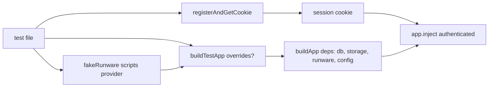

# build-test-app.ts — AI component doc

> AI-facing sidecar for `build-test-app.ts`. Created 2026-07-06. Keep this in sync with the code on every change.

## Purpose
Test-only factory that builds the API app with a fully in-memory `AppConfig` (SQLite `:memory:`, fake Runware key, mkdtemp media dir) so each test gets an isolated app instance without env vars or persistent disk state. Grows alongside `AppDeps` over plan Tasks 3→10; as of Task 10 it also ships the scripted Runware fake and the sign-up helper the generation lifecycle tests are built on.

## What it does (for an AI reader)
- Responsibilities: construct `buildApp(deps)` with deterministic test config, a fresh `createDb(':memory:').db` per call, a `createLocalStorage` rooted in a temp dir (test isolation), and an injectable `RunwareClient` (scripted fake by default) so no test can ever reach the real provider.
- Public API / exports:
  - `buildTestApp(overrides?: TestAppOverrides): Promise<FastifyInstance>`
  - `TestAppOverrides = { storageDir?, runware?, signupBonusCredits?, logLevel?, logStream?, nodeEnv?, webDistPath?, trustedOrigins?, trustProxy?, pollMinIntervalMs? }` — `storageDir` (Task 9) points `/media` at a caller-owned dir; `runware` (Task 10) injects a scripted provider; `signupBonusCredits` (Task 10) lowers the bonus for insufficient-credit tests; `logLevel`/`logStream` (ops hardening) raise the default-`silent` logger and capture pino NDJSON lines for `test/logging.test.ts`; `nodeEnv`/`webDistPath` (default `'test'` / nonexistent path) opt into production SPA serving for `test/static-web.test.ts`; `trustedOrigins` (default `['http://localhost:5173']`) drives `test/trusted-origins.test.ts`; `trustProxy` (default **false**, mirroring the TRUST_PROXY env default) lets `test/rate-limit.test.ts` pin per-forwarded-client buckets vs header-deaf default-deny; `pollMinIntervalMs` (default **0 = throttle disabled** — many suites script back-to-back polls of one generation and must see Runware answer each step) lets `test/generations-poll-throttle.test.ts` opt into a real interval; the production 3s default is pinned service-level in that same file.
  - `fakeRunware()` — `{ imageInference, submitVideo, getResponse }` as `vi.fn()`s: tests script resolutions per method AND assert call counts (e.g. "402 ⇒ provider never called").
  - `registerAndGetCookie(app, email?)` — signs up a fresh user via `POST /api/auth/sign-up/email` and returns a `cookie` header value; the `email` parameter exists so ownership tests can create a second account.
- Inputs → Outputs: optional overrides → a ready-to-`inject()` Fastify app; sign-up → session cookie string.
- Side effects: creates an in-memory SQLite database and (by default) a `mkdtemp` media dir under the OS tmpdir per call.

## Dependencies
- Imports / depends on: `src/app` (`buildApp`), `src/db/client` (`createDb`), `src/storage/local` (`createLocalStorage`), `src/integrations/runware/client` (type `RunwareClient`), `vitest` (`vi.fn` for the fake), `node:fs`/`node:os`/`node:path` (mkdtemp).
- Used by: every HTTP-level test in `apps/api/test/*.test.ts`; `fakeRunware`/`registerAndGetCookie` primarily by `generations.test.ts`.

## Diagram

## Key decisions / gotchas
- `signupBonusCredits: 200` default mirrors the plan's auth test expectation (`creditsBalance: 200`); Task 10's 402 test overrides it to 5 instead of crafting an expensive charge.
- `port: 0` — the app is never `listen()`ed in tests; only `inject()` is used.
- `storageDir` override exists so `/media` serving tests can write files into the dir the app serves; default stays a fresh mkdtemp so parallel tests never share media state. Temp dirs are left to the OS to reap.
- Default `runware` is a fresh `fakeRunware()` (cast to `RunwareClient` — `vi.fn()`s are untyped): pre-Task-10 tests never touch the provider, and a default fake guarantees an accidental provider call fails loudly (unscripted mock resolves `undefined`) instead of hitting the network.
- `registerAndGetCookie` keeps only the `name=value` pair of each Set-Cookie (drops Path/HttpOnly attrs) and joins with `; ` — that is what a browser would send back; better-auth may set more than one cookie.
- `logLevel` defaults to `'silent'` — the suite must stay quiet; the `logStream` spread is conditional because `AppDeps.logStream` is optional under `exactOptionalPropertyTypes` (passing an explicit `undefined` would not typecheck).
- `assetHostAllowlist: ['runware.ai']` in the test config mirrors the storage default (the SSRF gate); the helper's storage is built directly with the default list — SSRF-allowlist tests construct their own `createLocalStorage(dir, hosts)` instead of going through the app.
- `assetFetchTimeoutMs: 120_000` / `assetMaxBytes: 512MB` in the test config mirror the production defaults (download limits, review finding); tests probing the limits construct their own `createLocalStorage(dir, hosts, { fetchTimeoutMs, maxBytes })` with tight values instead of going through the app.

## Commits
- eb91028 feat(api): fastify skeleton with typed config and health route
- 273e3f4 feat(api): drizzle schema + sqlite bootstrap DDL — in-memory db injected
- 6c4e94f feat(api): local media storage with /media serving — storage dep + `storageDir` override
- 681e20f feat(api): generation lifecycle — `fakeRunware`, `registerAndGetCookie`, `runware`/`signupBonusCredits` overrides
- 5e8de3d feat(api): native env loading + structured logging — logLevel/logStream overrides, silent default
- b21a116 feat(api): production single-origin serving — nodeEnv/webDistPath/trustedOrigins overrides
- a7e4cd9 fix(api): ssrf allowlist, cursor tiebreaker, poll throttle — pollMinIntervalMs override (default 0), assetHostAllowlist in test config
- eb17afd fix(api): trust proxy for per-client rate limits behind the documented reverse proxy — trustProxy override (default false)
- de61e59 feat(api): db-level refund-once index + asset download limits — assetFetchTimeoutMs/assetMaxBytes in the test config (production defaults)

## Key decisions (2026-07-09) — wan-runpod
- `fakeVideoProvider()` (scripted `submit`/`poll`) + `TestAppOverrides.videoProviders` let routing tests assert which backend ran. `assetHostAllowlist` override flows into BOTH the test storage and config (mirrors prod auto-adding the pod host) so wan `/view` URLs pass the SSRF gate. `config.comfyBaseUrl: null` by default (tests inject a fake registry, not a live pod).
