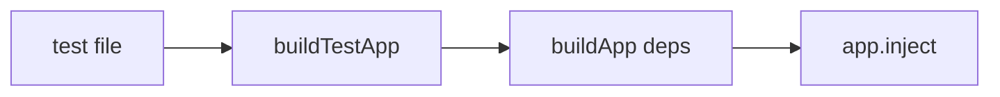

# build-test-app.ts — AI component doc

> AI-facing sidecar for `build-test-app.ts`. Created 2026-07-06. Keep this in sync with the code on every change.

## Purpose
Test-only factory that builds the API app with a fully in-memory `AppConfig` (SQLite `:memory:`, fake Runware key) so each test gets an isolated app instance without env vars or disk state. Grows alongside `AppDeps` over plan Tasks 3→6.

## What it does (for an AI reader)
- Responsibilities: construct `buildApp(deps)` with deterministic test config (and, from Task 4 on, a fresh in-memory db).
- Public API / exports: `buildTestApp(): Promise<FastifyInstance>`.
- Inputs → Outputs: none → a ready-to-`inject()` Fastify app.
- Side effects: creates an in-memory SQLite database per call (from Task 4).

## Dependencies
- Imports / depends on: `src/app` (`buildApp`); later `src/db/client` (`createDb`).
- Used by: every HTTP-level test in `apps/api/test/*.test.ts`.

## Diagram

## Key decisions / gotchas
- `signupBonusCredits: 200` mirrors the plan's auth test expectation (`creditsBalance: 200`).
- `port: 0` — the app is never `listen()`ed in tests; only `inject()` is used.

## Commits
- (pending) feat(api): fastify skeleton with typed config and health route
