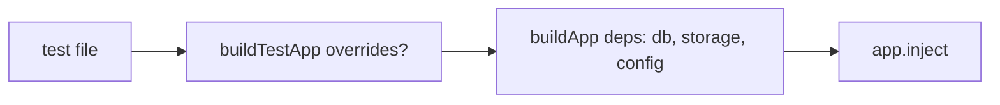

# build-test-app.ts — AI component doc

> AI-facing sidecar for `build-test-app.ts`. Created 2026-07-06. Keep this in sync with the code on every change.

## Purpose
Test-only factory that builds the API app with a fully in-memory `AppConfig` (SQLite `:memory:`, fake Runware key, mkdtemp media dir) so each test gets an isolated app instance without env vars or persistent disk state. Grows alongside `AppDeps` over plan Tasks 3→10.

## What it does (for an AI reader)
- Responsibilities: construct `buildApp(deps)` with deterministic test config, a fresh `createDb(':memory:').db` per call, and a `createLocalStorage` rooted in a temp dir (test isolation).
- Public API / exports: `buildTestApp(overrides?: TestAppOverrides): Promise<FastifyInstance>`; `TestAppOverrides` currently supports `storageDir` (Task 9) — Task 10 adds `runware`, `signupBonusCredits`.
- Inputs → Outputs: optional overrides → a ready-to-`inject()` Fastify app.
- Side effects: creates an in-memory SQLite database and (by default) a `mkdtemp` media dir under the OS tmpdir per call.

## Dependencies
- Imports / depends on: `src/app` (`buildApp`), `src/db/client` (`createDb`), `src/storage/local` (`createLocalStorage`), `node:fs`/`node:os`/`node:path` (mkdtemp).
- Used by: every HTTP-level test in `apps/api/test/*.test.ts`.

## Diagram

## Key decisions / gotchas
- `signupBonusCredits: 200` mirrors the plan's auth test expectation (`creditsBalance: 200`).
- `port: 0` — the app is never `listen()`ed in tests; only `inject()` is used.
- `storageDir` override exists so `/media` serving tests can write files into the dir the app serves; default stays a fresh mkdtemp so parallel tests never share media state. Temp dirs are left to the OS to reap.

## Commits
- eb91028 feat(api): fastify skeleton with typed config and health route
- 273e3f4 feat(api): drizzle schema + sqlite bootstrap DDL — in-memory db injected
- 6c4e94f feat(api): local media storage with /media serving — storage dep + `storageDir` override
