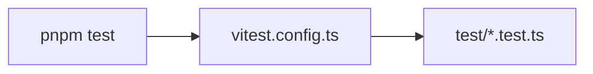

# vitest.config.ts — AI component doc

> AI-facing sidecar for `vitest.config.ts`. Created 2026-07-06. Keep this in sync with the code on every change.

## Purpose
Vitest configuration for `@opencreate/api`, exactly per plan Task 3: an empty `defineConfig({})` — defaults are correct (node environment, `test/**/*.test.ts` auto-discovery).

## What it does (for an AI reader)
- Responsibilities: let `pnpm --filter @opencreate/api test` (`vitest run`) discover `test/**/*.test.ts`.
- Public API / exports: default export — Vitest config object.
- Inputs → Outputs: none → default Vitest behavior.
- Side effects: none (config only).

## Dependencies
- Imports / depends on: `vitest/config` (dev dep `vitest`).
- Used by: package `test` script; root `pnpm test` (recursive).

## Diagram

## Key decisions / gotchas
- Intentionally empty: API tests run in the default node environment; no globals, no setup files needed for MVP.

## Commits
- (pending) feat(api): fastify skeleton with typed config and health route
