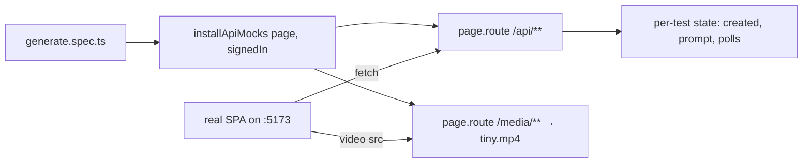

# mocks.ts — AI component doc

> AI-facing sidecar for `e2e/mocks.ts`. Created 2026-07-06. Keep this in sync with the code on every change.

## Purpose
Browser-level API mocking for the Playwright e2e suite (plan Task 21): every `/api/**` and `/media/**` request is intercepted with `page.route`, so the tests exercise the REAL SPA served by the vite dev server against a fully scripted, deterministic backend — no Fastify process, no Runware key, no database.

## What it does (for an AI reader)
- Responsibilities: hold per-test backend state (`created`, `prompt`, `polls`), answer the exact endpoints the SPA calls, and script the async video lifecycle: POST → 202 processing/0% → first GET :id → processing/40% → second GET :id → succeeded with `/media/gen-e2e-1.mp4`.
- Public API / exports:
  - `installApiMocks(page, { signedIn = true })` — installs both route handlers; `signedIn: false` makes get-session answer JSON `null` and `/api/me` a 401 envelope (landing/anonymous tests).
  - `START_BALANCE` (200) and `COST` (35) — exported so the spec asserts the balance drop (200 → 165) against the same constants the mock uses.
- Endpoints scripted: `/api/auth/get-session` (better-auth session or null), `/api/me` (balance drops by COST after creation), `/api/catalog` (Flash image + Swift video, 5s = 35 credits), `POST /api/generations` (202 + processing DTO, remembers the prompt), `GET /api/generations` list (agrees with poll state — an empty answer post-transition would wipe the succeeded card on invalidation refetch), `GET /api/generations/:id` (the poll: processing/40 then succeeded), `/api/credits/transactions` (empty), anything else → loud 404 envelope naming the missing mock.
- Inputs → Outputs: Playwright `Page` → routes installed; browser requests → canned contracts-shaped JSON / the committed `fixtures/tiny.mp4` bytes (`video/mp4`).
- Side effects: none outside the page — state is a per-install closure, so parallel tests never share it.

## Dependencies
- Imports / depends on: `@playwright/test` types (`Page`, `Route`), `node:fs`/`node:path` (fixture bytes). Fixture: `e2e/fixtures/tiny.mp4` (52-byte minimal ftyp+mdat file — `<video>` mounts, playback is never asserted).
- Used by: `e2e/generate.spec.ts`.

## Diagram

## Key decisions / gotchas
- The generation turns terminal on the SECOND `:id` poll: the first must render the 40% progress UI, and the SPA's 4s `refetchInterval` drives the second — this mirrors the API's poll-on-read design.
- The list endpoint reads `currentGeneration()` too: after the terminal transition the SPA invalidates `['generations']` and refetches; the list answering empty would overwrite the prepended cache entry and the card would vanish mid-test.
- Fixture dates/expiry are fixed and far-future so better-auth's client never marks the session stale mid-run.
- Unscripted paths 404 with the pathname in the message — a missing mock should fail pointing at itself, not as a mystery UI state.
- ESM note: `import.meta.dirname` works because the package is `"type": "module"` and Playwright ≥1.44 runs ESM natively on Node 22.

## Commits
- 3a30d65 test(web): e2e happy path with mocked api
