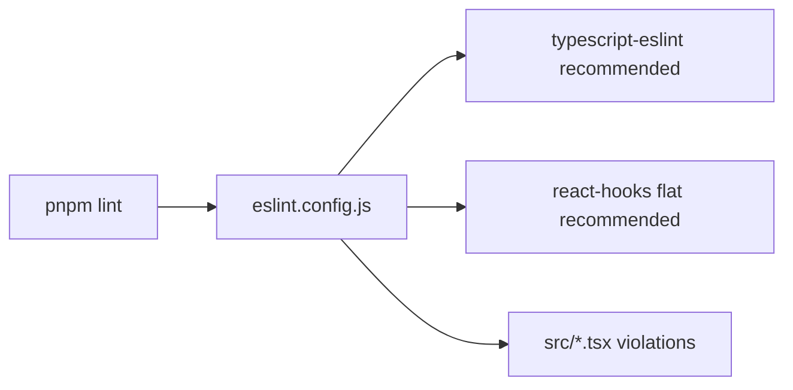

# eslint.config.js — AI component doc

> AI-facing sidecar for `eslint.config.js`. Created 2026-07-06. Keep this in sync with the code on every change.

## Purpose
Flat ESLint config for `@opencreate/web`: the api baseline (typescript-eslint recommended + zero-`any`) plus React additions — `eslint-plugin-react-hooks` recommended rules, per plan Task 3's "same file copied in web with react additions".

## What it does (for an AI reader)
- Responsibilities: configure ESLint (flat config) for the web package's `src` TS/TSX sources, including rules-of-hooks/exhaustive-deps enforcement.
- Public API / exports: default export — `tseslint.config(recommended, reactHooks.configs.flat.recommended, { rules })` array.
- Inputs → Outputs: lints `src/**/*.{ts,tsx}` → violations reported by `pnpm --filter @opencreate/web lint`.
- Side effects: none (config only).

## Dependencies
- Imports / depends on: `typescript-eslint`, `eslint-plugin-react-hooks` (dev deps).
- Used by: package `lint` script (`eslint src`); root `pnpm lint` (recursive).

## Diagram

## Key decisions / gotchas
- Installed `eslint-plugin-react-hooks` is v7: the flat preset lives at `configs.flat.recommended` (NOT the legacy `configs.recommended`, which is eslintrc-format). Verified against node_modules before writing.

## Commits
- _no commit yet_
