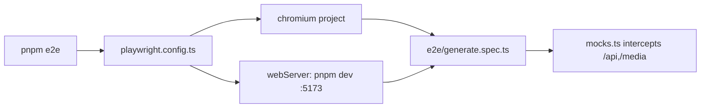

# playwright.config.ts — AI component doc

> AI-facing sidecar for `playwright.config.ts`. Created 2026-07-06. Keep this in sync with the code on every change.

## Purpose
Playwright configuration for the e2e suite (plan Task 21): boots the real vite dev server on :5173 and runs `e2e/*.spec.ts` against it in Chromium, with every backend call mocked per-test in `e2e/mocks.ts`.

## What it does (for an AI reader)
- Responsibilities: point the runner at `./e2e`, set `baseURL: http://localhost:5173`, define the single `chromium` project (Desktop Chrome), and own the `webServer` block (`pnpm dev`, port 5173, `reuseExistingServer` locally so a running dev server is reused; CI always boots fresh).
- Public API / exports: default export — `PlaywrightTestConfig` via `defineConfig`.
- Inputs → Outputs: `pnpm e2e` → dev server (if needed) + browser test run; failures leave traces (`trace: 'retain-on-failure'`).
- Side effects: spawns/kills the vite dev server; writes `test-results/` + `playwright-report/` on failure (both gitignored).

## Dependencies
- Imports / depends on: `@playwright/test` (`defineConfig`, `devices`).
- Used by: `pnpm --filter @opencreate/web e2e` (`playwright test`); consumes `e2e/generate.spec.ts` + `e2e/mocks.ts`.

## Diagram

## Key decisions / gotchas
- `fullyParallel: true` is safe because mock state is a per-`installApiMocks` closure — tests share nothing.
- Retries stay 0 locally on purpose: with a fully scripted backend a flaky test is a real bug, not network weather.
- Chromium only (plan decision): the suite verifies SPA wiring (router/guards/query-cache/polling), not cross-browser rendering.
- No API process is needed: the vite proxy to :8787 is never hit because `page.route` intercepts before the network layer.

## Commits
- _no commit yet_
