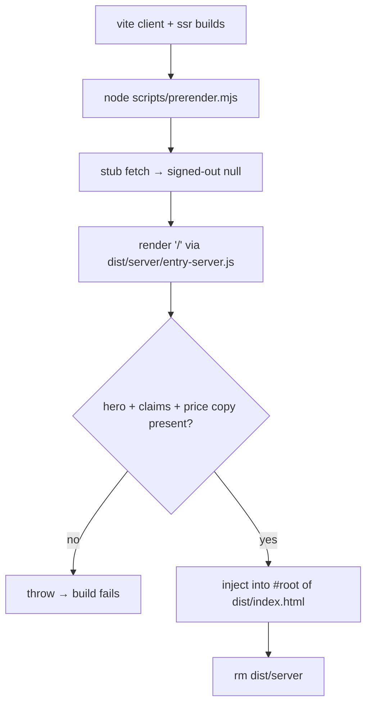

# prerender.mjs — AI component doc

> AI-facing sidecar for `scripts/prerender.mjs`. Created 2026-07-07. Keep this in sync with the code on every change.

## Purpose
Post-build step that makes the landing page crawlable (spec §1): renders `'/'` with the SSR bundle and injects the HTML into `dist/index.html`'s `#root`. Fails the build if the landing copy is missing, so an empty prerender can never regress silently.

## What it does (for an AI reader)
- Responsibilities: stub `globalThis.fetch` (signed-out `null` for any request — the SSR pass must never touch the network), import `dist/server/entry-server.js`, `render('/')`, assert the required landing copy is present, replace `

` with the populated div (callback replace — rendered HTML may contain `$` substitution patterns), delete the intermediate `dist/server/`.
- Public API / exports: none — executed by `pnpm build` (`node scripts/prerender.mjs`, last step after both vite builds).
- Inputs → Outputs: `dist/server/entry-server.js` + `dist/index.html` (template) → `dist/index.html` with prerendered landing HTML; `dist/server/` removed.
- Side effects: rewrites `dist/index.html`; removes `dist/server/`; exits non-zero (failing the build) when copy or the #root marker is missing.

## Dependencies
- Imports / depends on: `node:fs/promises`, `node:path`, `node:url`, and (at runtime) the `vite build --ssr` output of `src/entry-server.tsx`.
- Used by: `apps/web/package.json` `build` script — `tsc --noEmit && vite build && vite build --ssr src/entry-server.tsx --outDir dist/server && node scripts/prerender.mjs`.

## Diagram

## Key decisions / gotchas
- The fetch stub exists because better-auth's client resolves a relative `/api/auth` base URL outside a browser; a real fetch would reject with an unparseable-URL error as an unhandled rejection and kill the build.
- `requiredCopy` strings must match `locales/en.json` (`landing.headline` tail, `landing.claims.expire`, `landing.price.title`) — update together. The headline's `&` is HTML-escaped by renderToString, hence the substring choice.
- SPA-fallback hosting serves this prerendered index.html for every route; non-`/` routes briefly show landing markup until `main.tsx` renders — accepted MVP trade-off, SEO only targets `/`.

## Commits
- 1e925aa fix(web): prerender the landing route at build for SEO
