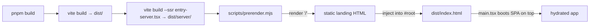

# entry-server.tsx — AI component doc

> AI-facing sidecar for `src/entry-server.tsx`. Created 2026-07-07. Keep this in sync with the code on every change.

## Purpose
Build-time SSR entry that renders SPA routes to static HTML — implements the spec's SEO requirement (§1: "Landing route prerendered at build for SEO"), the mitigation the user approved for choosing SPA + separate API instead of Next.js. Without it crawlers receive an empty `

`.

## What it does (for an AI reader)
- Responsibilities: build a TanStack Router over the generated `routeTree` with a memory history (no `window` at build time), `await router.load()` to resolve code-split route components, and `renderToString(<RouterProvider/>)`.
- Public API / exports: `render(url: string): Promise<string>` — static HTML for the given route.
- Inputs → Outputs: route path (`'/'` in practice) → HTML string with the landing hero/claims/price copy.
- Side effects: i18n side-effect init (EN default — no stored language outside a browser, matching index.html's `lang="en"`). No effects run during `renderToString`, so TanStack Query never fetches and the session renders signed-out — the anonymous-crawler view by design.

## Dependencies
- Imports / depends on: `react-dom/server` (`renderToString`), `@tanstack/react-router` (`createRouter`, `createMemoryHistory`, `RouterProvider`), `./routeTree.gen`, `shared/config/i18n` (side effect).
- Used by: `scripts/prerender.mjs` (via the `vite build --ssr` output `dist/server/entry-server.js`) and `src/entry-server.test.tsx` (pins the landing copy in the rendered HTML). NOT part of the browser bundle.

## Diagram

## Key decisions / gotchas
- Memory history, not browser history: there is no `window` during the build.
- The prerender is intentionally the signed-out EN view — exactly what an anonymous crawler sees; `main.tsx` re-renders with the real session/language on boot.
- Callers in plain Node must stub `globalThis.fetch` first: better-auth's session store can fire a relative-URL get-session fetch that Node cannot parse (see prerender.mjs / the vitest stub).
- Keep the required landing copy assertions in `scripts/prerender.mjs` and `entry-server.test.tsx` in sync with `locales/en.json`.

## Commits
- 1e925aa fix(web): prerender the landing route at build for SEO
