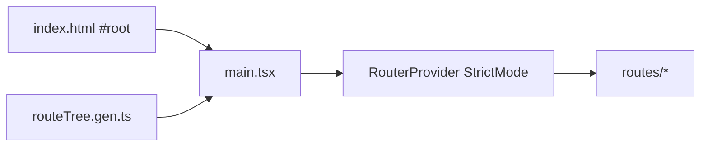

# main.tsx — AI component doc

> AI-facing sidecar for `main.tsx`. Created 2026-07-06. Keep this in sync with the code on every change.

## Purpose
SPA entry point: builds the typed TanStack Router from the generated route tree and mounts the React app under `#root` in StrictMode.

## What it does (for an AI reader)
- Responsibilities: `createRouter({ routeTree })`, register the router type via `declare module '@tanstack/react-router'` (declaration merging — the one sanctioned `interface` use), guard against a missing `#root`, render `<RouterProvider>`.
- Public API / exports: none (entry module referenced from `index.html`).
- Inputs → Outputs: `routeTree.gen.ts` + DOM `#root` → mounted app.
- Side effects: DOM render; module-level router construction.

## Dependencies
- Imports / depends on: `react`, `react-dom/client`, `@tanstack/react-router`, `./routeTree.gen` (generated), `shared/config/theme.css` (Tailwind v4 entry + Paper & Ink tokens — the app's only stylesheet, imported once here).
- Used by: `index.html` (`<script type="module" src="/src/main.tsx">`).

## Diagram

## Key decisions / gotchas
- `Register` augmentation makes every `<Link to>`/`navigate` statically typed against real routes; tests build their own router instances with memory history instead of importing this module.
- `routeTree.gen.ts` is produced by the vite plugin on dev/build/test start — run any script once before `tsc` if the file is missing.

## Commits
- c987d5f 2026-07-06 feat(web): vite scaffold, tanstack router, i18n, providers
