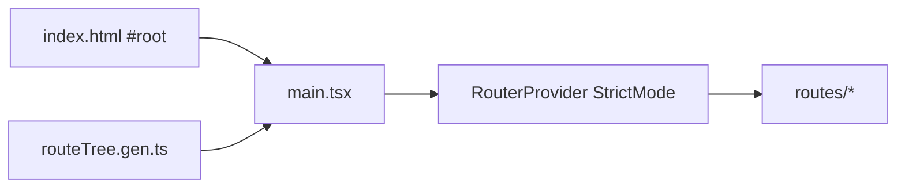

# main.tsx — AI component doc

> AI-facing sidecar for `main.tsx`. Created 2026-07-06. Keep this in sync with the code on every change.

## Purpose
SPA entry point: builds the typed TanStack Router from the generated route tree and mounts the React app under `#root` in StrictMode.

## What it does (for an AI reader)
- Responsibilities: load the self-hosted fonts (JetBrains Mono 400/500 latin+cyrillic, DM Sans 400/500 latin) BEFORE the stylesheet, `createRouter({ routeTree })`, register the router type via `declare module '@tanstack/react-router'` (declaration merging — the one sanctioned `interface` use), guard against a missing `#root`, render `<RouterProvider>`.
- Public API / exports: none (entry module referenced from `index.html`).
- Inputs → Outputs: `routeTree.gen.ts` + DOM `#root` → mounted app.
- Side effects: DOM render; module-level router construction; global @font-face + stylesheet registration.

## Dependencies
- Imports / depends on: `react`, `react-dom/client`, `@tanstack/react-router`, `./routeTree.gen` (generated), `@fontsource/jetbrains-mono` (`latin-400/500.css` + `cyrillic-400/500.css` — THE typeface of design v3; Cyrillic is explicit because RU is a first-class locale), `@fontsource/dm-sans` (`latin-400/500.css` — sparing secondary body face; no Cyrillic subset exists so RU prose falls back to the system sans), `shared/config/theme.css` (Tailwind v4 entry + v3 "Bioluminescent Terminal" tokens — the app's only stylesheet, imported once here, AFTER the fonts so the `--font-*` tokens resolve).
- Used by: `index.html` (`<script type="module" src="/src/main.tsx">`).

## Diagram

## Key decisions / gotchas
- `Register` augmentation makes every `<Link to>`/`navigate` statically typed against real routes; tests build their own router instances with memory history instead of importing this module.
- `routeTree.gen.ts` is produced by the vite plugin on dev/build/test start — run any script once before `tsc` if the file is missing.
- Fonts are self-hosted via @fontsource (no external requests, `font-display: swap`). v3 restyle removed the Fraunces/Space Grotesk packages entirely (dead weight once no token referenced them); JetBrains Mono ships REAL Cyrillic (imported explicitly), DM Sans does not — RU prose in `font-sans` contexts uses the system fallback (accepted, design.md v3 §3).
- Only the 400/500 weights are imported — the design law forbids any weight above 500 ("whisper-weight display"), so heavier files would be unreachable bytes.

## Commits
- c987d5f 2026-07-06 feat(web): vite scaffold, tanstack router, i18n, providers
- 51d80a6 2026-07-06 feat(web): paper&ink design system, shared ui kit, error-ux surfaces
- 3305c12 2026-07-07 restyle(web): editorial design system — tokens, fonts, ui kit (fonts imported before theme.css; explicit space-grotesk .css path for TS2882)
- (pending) restyle(web): terminal design system — cosmic void tokens, jetbrains mono, specimen pills + docs
