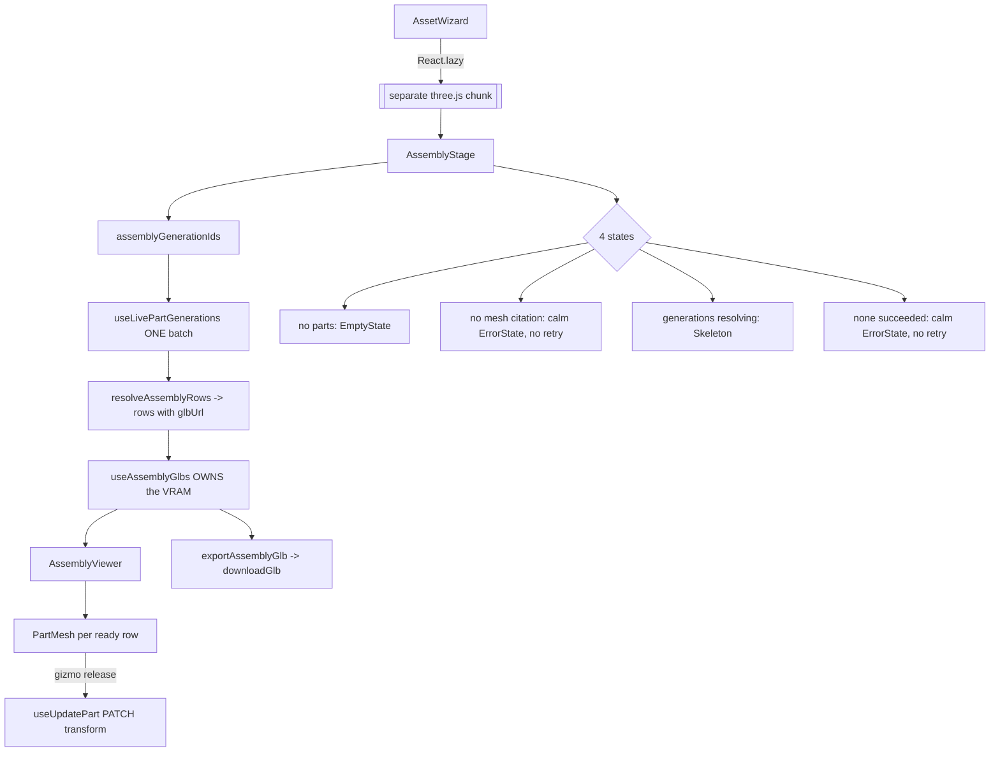

# AssemblyStage.tsx — AI component doc

> AI-facing sidecar for `AssemblyStage.tsx`. Created 2026-07-20. Keep this in sync with the code on every change.

## Purpose
**THE LAZY BOUNDARY** (ADR `modular-3d-assets` D4 → `photo-to-3d-studio` D6) and the
wizard's last act. `AssetWizard` reaches this file through `React.lazy`, so every
three.js / R3F / drei import in the module hangs off it and stays in a separate chunk.
It is also the **VRAM owner**: one loader call for the whole set, scenes passed down.

## What it does (for an AI reader)
- Responsibilities: resolve each part's mesh generation by id, own `useAssemblyGlbs`,
  render the 4 UI states, the gizmo-mode toggle, the per-part load list, the viewer, and
  the GLB export.
- Public API / exports: `AssemblyStage`, `AssemblyStageProps`.
  Props: `assetId: string`, `parts: Asset3dPart[]` — **contract with `AssetWizard`, do not
  change either half.**
- Inputs → Outputs: asset id + parts → the assembly workspace, and a downloaded merged GLB.
- Side effects: `useAsset` (cache read for the export filename), `useLivePartGenerations`
  (batch), `useAssemblyGlbs` (GLB fetch + GPU memory), `useUpdatePart` (PATCH transform),
  `downloadGlb` (object URL + anchor click).

## Dependencies
- Imports / depends on: `shared/ui` (`Button`, `Card`, `EmptyState`, `ErrorState`,
  `PillGroup`, `Skeleton`), `../model/{asset3dApi, partGeneration, assemblyRows, exportGlb,
  useAssemblyGlb, webglSupport, wizardStore}`, `./AssemblyViewer`.
- Used by: `AssetWizard.tsx`, exclusively via `React.lazy(() => import('./AssemblyStage'))`.

## Diagram

## Key decisions / gotchas
- **CONTRACT:** named export `AssemblyStage`, props `{ assetId, parts }`. The stage HEADING
  is rendered by `AssetWizard`; this file owns only the BODY (which is why the Suspense
  fallback never hides the heading).
- **Every three.js import must be STATIC and at or below this file**, or it leaks back into
  the main bundle and the lazy boundary becomes decorative.
- **ONE loader owner.** `useAssemblyGlbs` is called here for the whole set and the scenes go
  DOWN to `PartMesh` and ACROSS to `exportGlb`. `PartMesh` deliberately loads nothing — two
  owners would fetch every GLB twice and double the memory the loader exists to bound.
- **`isWebGLAvailable` is read once into `useState`,** not per render: the answer cannot
  change while the stage is open, and each probe makes and releases a real context.
- **Fix FG-3 is honoured through `resolveAssemblyRows`** — the GLB url is `mediaUrls[0]` of
  the resolved SUCCEEDED mesh generation, never derived from the bare `meshGenerationId`.
- **Two DIFFERENT calm errors, both without retry:** `noMesh` (no part cites a mesh) and
  `noneReady` (meshes exist, none produced a file). Neither is retryable from this stage —
  the fix is upstream in the Mesh stage — so offering a retry button would be a lie.
- **Export only includes parts that actually LOADED,** and `exportAssemblyGlb` refuses an
  empty set, so a blank GLB can never reach the user. The button is disabled at
  `readyCount === 0`.
- **The export error is a boolean, never the thrown text** — writer internals are not user
  copy.
- **`useAsset` is read only for the export filename.** It is already in the `['asset3d', id]`
  cache (AssetWizard loaded it), so this costs no extra request.
- Per-part load state renders OUTSIDE the canvas so it is readable — and testable — without
  WebGL. Keyed by part id, never the array index.
- **Known limitation:** `useLivePartGenerations` carries no poll interval (it only reads the
  shared cache). That is correct here because `deriveStage` only routes to Assembly when
  every part is already `ready`; a mesh re-rolled while standing on this stage will not
  self-refresh until the aggregate is invalidated.

## Commits
- _no commit yet_
