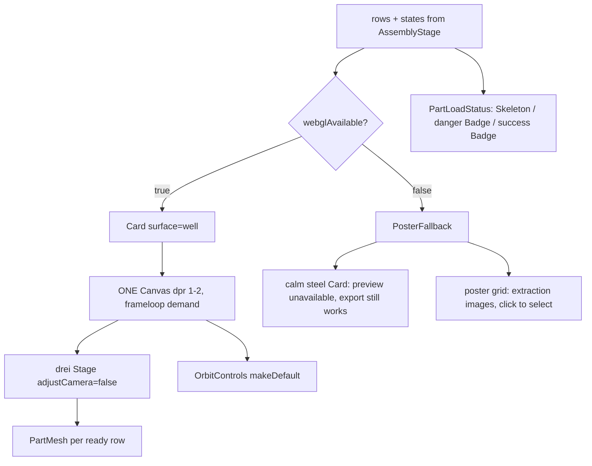

# AssemblyViewer.tsx — AI component doc

> AI-facing sidecar for `AssemblyViewer.tsx`. Created 2026-07-20. Keep this in sync with the code on every change.

## Purpose
The **ONE `<Canvas>` in the whole application**, plus the no-WebGL fallback that replaces
it (ADR `photo-to-3d-studio` D6, applied verbatim by `modular-3d-assets` D4). It decides
between a real 3D scene and a poster grid, and owns every way a part's load state is shown.

## What it does (for an AI reader)
- Responsibilities: render the canvas (or the fallback), mount one `PartMesh` per resolved
  row, and surface per-part load state. It does NOT load, dispose, fetch or mutate.
- Public API / exports:
  - `AssemblyViewer` — props (`AssemblyViewerProps`): `rows: AssemblyRow[]`,
    `states: GlbState[]` (index-aligned with `rows`), `selectedPartId: string | null`,
    `gizmoMode`, `onSelect(partId)`, `onTransform(partId, transform)`,
    `webglAvailable: boolean`.
  - `PartLoadStatus` — `{ row, state }` → a `Skeleton` / danger `Badge` / success `Badge`.
- Inputs → Outputs: resolved rows + their `GlbState`s → a canvas or a poster grid.
- Side effects: none of its own; the `<Canvas>` allocates a WebGL context while mounted.

## Dependencies
- Imports / depends on: `@react-three/fiber` (`Canvas`), `@react-three/drei` (`Stage`,
  `OrbitControls`), `shared/ui` (`Badge`, `Card`, `Skeleton`), `react-i18next`,
  `AssemblyRow` from `../model/assemblyRows`, `GlbState` from `../model/useAssemblyGlb`,
  `./PartMesh`.
- Used by: `AssemblyStage.tsx` only — which is the lazy boundary, so R3F/drei/three never
  reach the main bundle.

## Diagram

## Key decisions / gotchas
- **EXACTLY ONE `<Canvas>` alive.** Browsers cap live WebGL contexts at ~8-16 and silently
  kill the oldest past the cap; a second canvas anywhere in the app would start evicting
  this one.
- **`dpr={[1,2]}`** — uncapped DPR on a 3x phone renders 9x the pixels for no visible gain,
  and that is the memory spike that loses the context.
- **`frameloop="demand"`** — a scene rendering forever in a background tab drains battery and
  invites the OOM that kills the context.
- **The fallback is a FEATURE, not an apology.** It covers blocklisted GPUs, hardened
  browsers, privacy modes and crawlers/OG bots — and it is what makes the stage testable in
  jsdom, where `isWebGLAvailable()` is false. Real WebGL is never exercised in Vitest.
- **The poster is the part's EXTRACTION image, never its mesh media.** A mesh's
  `mediaUrls[0]` is the GLB itself, which no `` can display. A row with a null
  `posterUrl` keeps its tile shape rather than collapsing the grid.
- **`Stage adjustCamera={false}`** — drei's Stage reframes whenever its children change,
  which would yank the view out from under the user every time another part finished
  loading.
- **`OrbitControls makeDefault`** — `TransformControls` needs to find and suspend the
  controls mid-drag; without it, dragging a gizmo also orbits the camera.
- **A row that is not `ready` renders nothing in 3D.** There is no sensible placeholder
  inside a scene; the counter and `PartLoadStatus` above the canvas carry that information.
- **`PartLoadStatus` never prints `state.message`.** That is an internal marker from
  `useAssemblyGlb`; the user sees a localized `assets3d.assembly.partFailed`.
- Media sits in `Card surface="well" padding="none"` — never glass. A translucent frame over
  a 3D scene reads as a rendering bug. No gradients anywhere (design.md hard rule).

## Commits
- _no commit yet_
