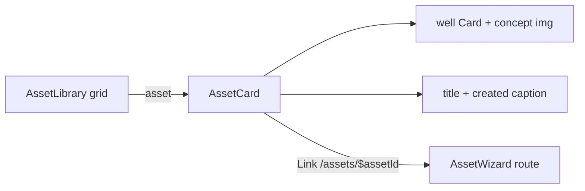

# AssetCard.tsx — AI component doc

> AI-facing sidecar for `AssetCard.tsx`. Created 2026-07-20. Keep this in sync with the code on every change.

## Purpose
One modular asset in the `/assets` grid: a glass `Card` whose picture area is a
recessed WELL plate holding the concept image, with the title and a created date
beneath. The whole card is a typed `<Link>` into that asset's wizard.

## What it does (for an AI reader)
- Responsibilities: render the concept thumbnail, title and localized created date;
  navigate to `/assets/$assetId`.
- Public API / exports / props / endpoints: `AssetCard`, `AssetCardProps`.
  Props: `asset: Asset3d` (the list payload — no parts).
- Inputs → Outputs: one `Asset3d` → a linked card. Date via `Intl.DateTimeFormat`
  on the active i18n language; the ISO string stays the source of truth.
- Side effects (I/O, network, state): none — no queries, no mutations.

## Dependencies
- Imports / depends on: `@tanstack/react-router` (`Link`), `react-i18next`,
  `@opencreate/contracts` (`Asset3d`), `shared/ui` (`Card`).
- Used by: `AssetLibrary`.

## Diagram

## Key decisions / gotchas
- **The concept image is CONTENT, so it sits on a `well`, never on glass**
  (design.md §3.5 / the `GenerationCard` rule): frosting a card around the picture
  the user uploaded lays a lit edge, a blur and a shadow over what the eye is reading.
- **No "missing image" branch.** The API refuses a create without a concept
  (`createAsset3dInputSchema.conceptImage` is required), so `conceptImageUrl` is
  always populated on a stored asset — a fake empty state here would be dead code.
- The hover lift lives on the `<Link>`, not the `Card`, so the Card's surface classes
  are never overridden through its layout-only `className`.
- `aspect-square` (not the film canvas ratios): a concept photo has no output aspect
  to preview, and equal plates make the shelf read as a grid.

## Commits
- _no commit yet_
