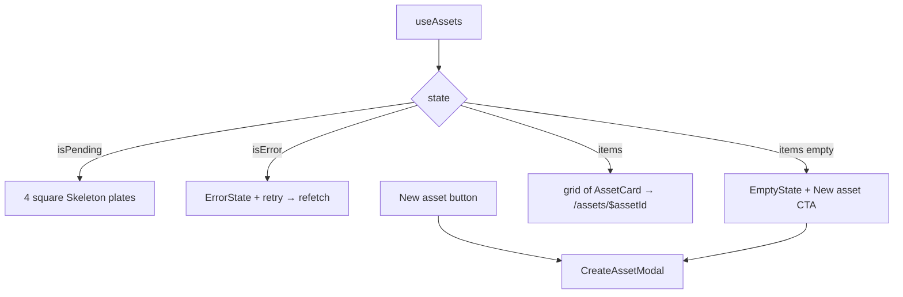

# AssetLibrary.tsx — AI component doc

> AI-facing sidecar for `AssetLibrary.tsx`. Created 2026-07-20. Keep this in sync with the code on every change.

## Purpose
The `/assets` page body: the modular-asset library implementing the full 4-states
rule plus the create modal. The route owns the page canvas; this owns the library.

## What it does (for an AI reader)
- Responsibilities: run `useAssets()` and render exactly one of four states —
  loading (4 card-shaped skeleton silhouettes), error (`ErrorState` + retry),
  empty (`EmptyState` + create CTA), data (grid of `AssetCard`) — and own the
  open/closed state of `CreateAssetModal`.
- Public API / exports / props / endpoints: `AssetLibrary` (no props).
  Endpoint via `useAssets`: `GET /api/assets3d` (`['assets3d']`).
- Inputs → Outputs: the assets list query → a page section with a heading, a
  green create pill and the grid.
- Side effects (I/O, network, state): the list query + its `refetch`; local
  `isCreateOpen` boolean.

## Dependencies
- Imports / depends on: `react-i18next`, `shared/ui` (`Button`, `EmptyState`,
  `ErrorState`, `Skeleton`), `../model/asset3dApi` (`useAssets`), `./AssetCard`,
  `./CreateAssetModal`.
- Used by: `routes/_shell.assets.index.tsx` (via the module barrel).

## Diagram

## Key decisions / gotchas
- **The CinemaLibrary silhouette on purpose.** Both screens are "a shelf of things
  you open into a multi-stage workbench"; a user who learned one should not have to
  learn the other. Skeleton shapes match the real card (square plate + two meta
  lines) so the grid never reflows when data lands.
- **The create pill is GREEN, not ghost.** It is the single create action on the
  screen and it is FREE — the prices live on the wizard's later stages. (Cinema
  splits green/ghost only because Templates competes for the primary slot there.)
- **`CreateAssetModal` is mounted only while open**, so each attempt starts from a
  clean form — a stale data URI from an abandoned attempt would otherwise persist in
  RHF state and silently submit later.
- Skeleton plates use `rounded-2xl` (the Card radius) so the grid does not
  re-corner itself when the real cards arrive.
- No cross-module imports: this file talks only to its own `model/` and `shared/ui`.

## Commits
- _no commit yet_
