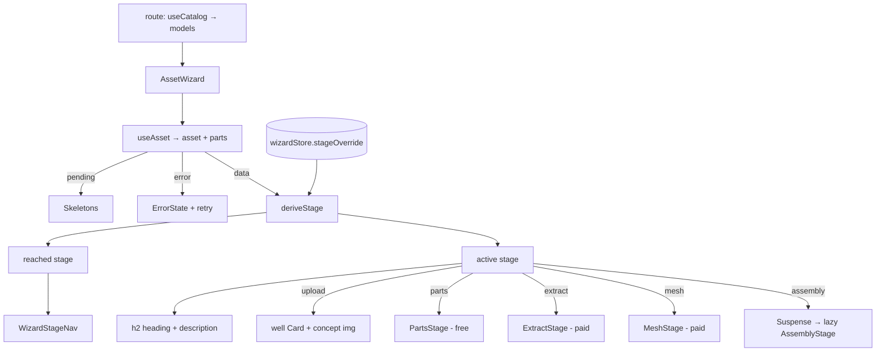

# AssetWizard.tsx — AI component doc

> AI-facing sidecar for `AssetWizard.tsx`. Created 2026-07-20. Keep this in sync with the code on every change.

## Purpose
The wizard shell for ONE modular 3D asset (ADR D6). It is STAGE-shaped, not
page-shaped: a single `$assetId` route, and the asset's own state decides which of
the five acts (Concept → Parts → Extraction → Meshes → Assembly) is on screen.

## What it does (for an AI reader)
- Responsibilities: own `useAsset(assetId)` and its 4 states; derive the active stage
  via `deriveStage` (+ the store's `stageOverride`); render the header, the stage rail
  and the stage HEADING; hold the `React.lazy` boundary for `AssemblyStage`; reset the
  wizard store when the asset changes.
- Public API / exports / props / endpoints: `AssetWizard`, `AssetWizardProps`.
  Props: `assetId: string`, `models: CatalogModel[]` (the route's catalog seam).
  Endpoint via `useAsset`: `GET /api/assets3d/:id` (`['asset3d', id]`).
- Inputs → Outputs: route param + catalog → the correct stage on screen.
- Side effects (I/O, network, state): the aggregate query + `refetch`; a `reset()`
  effect keyed on `assetId`; writes `stageOverride` through the rail's `onSelect`.

## Dependencies
- Imports / depends on: `react` (`Suspense`, `lazy`, `useEffect`),
  `@tanstack/react-router` (`Link`), `react-i18next`, `@opencreate/contracts`
  (`CatalogModel`), `shared/ui` (`Card`, `ErrorState`, `Skeleton`),
  `../model/asset3dApi`, `../model/wizardStage`, `../model/wizardStore`,
  `./WizardStageNav`, `./PartsStage`, `./ExtractStage`, `./MeshStage`, and lazily
  `./AssemblyStage`.
- Used by: `routes/_shell.assets.$assetId.tsx` (via the module barrel).

## Diagram

## Key decisions / gotchas
- **Derived, not routed.** A stage is not a place — it describes how far the work has
  got. A `/assets/:id/mesh` URL would be a promise the data cannot keep: reload it with
  nothing extracted and the screen is empty and reads as broken. The rail, not the URL,
  offers the detours.
- **`reached` and `active` are computed separately** (`deriveStage` with and without the
  override) because the rail needs both: reachability must follow the DATA, not the
  detour, or walking back would lock the user out of walking forward.
- **`AssemblyStage` is THE lazy boundary** (ADR D4 → photo-to-3d-studio D6). The whole
  three.js graph hangs off it, so `lazy()` here is what keeps it out of the main chunk.
  The ROUTE cannot be `createLazyFileRoute` — Concept/Parts/Extraction/Mesh belong in
  the main bundle; only the viewer is heavy enough to justify a round trip.
- **The stage HEADING lives in this file, not in the stage bodies.** It is the same two
  lines for all five acts, so owning it centrally lets a body be swapped or lazily
  loaded without the page losing its heading (and keeps the heading out of the
  Suspense fallback).
- **The store reset is a `useEffect`, deliberately.** The store is a module singleton
  and the route param is not; navigating between assets reuses this component, so the
  previous asset's selection — or its open spend dialog — would otherwise ride along.
  Writing to an external store during render is unsafe under concurrent rendering.
- **An empty catalog is a first-class DISABLED state, never an error.** `models` may be
  `[]` while `['catalog']` is in flight; `PriceTag` pulses and paid affordances stay
  off rather than quote an unbacked number. The pricing now lives INSIDE the stages —
  this file no longer imports `assetPricing`/`PriceTag`.
- **Seam contract (now satisfied)**: `PartsStage`, `ExtractStage` and `MeshStage` all take
  `{ assetId, parts, models }`. `PartsStage` is FREE and takes `models` only to PRINT the
  extraction price beside its forward CTA; it spends nothing. `AssemblyStage` keeps its
  named export and its `{ assetId, parts }` props — this file's lazy import depends on both.
- **Stage bodies own only the BODY.** The `h2` + description above them belongs to this
  file, so a stage component must never render its own stage heading.

## Commits
- _no commit yet_
