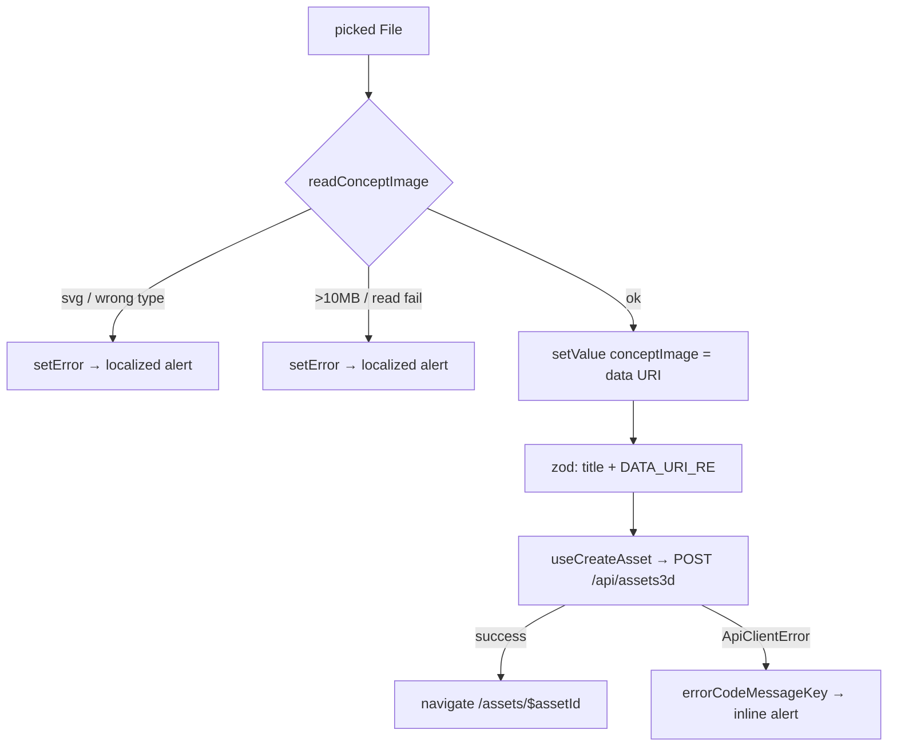

# CreateAssetModal.tsx — AI component doc

> AI-facing sidecar for `CreateAssetModal.tsx`. Created 2026-07-20. Keep this in sync with the code on every change.

## Purpose
The create form for a modular 3D asset: a title and the ONE concept image every
part is later extracted from. Creating is FREE (money starts at extraction), and
the form says so. On success it navigates into the new asset's wizard.

## What it does (for an AI reader)
- Responsibilities: RHF + Zod validation (title 1..120, concept must be a
  png/jpeg/webp base64 data URI), local FileReader encoding, localized error
  surfaces, `useCreateAsset` submission, navigation to `/assets/$assetId`.
- Public API / exports / props / endpoints: `CreateAssetModal`,
  `CreateAssetModalProps`. Props: `isOpen: boolean`, `onClose: () => void`.
  Endpoint (via `useCreateAsset`): `POST /api/assets3d`.
- Inputs → Outputs: a typed title + a picked File → `{ title, conceptImage }`
  where `conceptImage` is `data:image/(png|jpeg|webp);base64,…`.
- Side effects (I/O, network, state): the create mutation (invalidates
  `['assets3d']`), a router navigation, local `serverErrorKey` state.

## Dependencies
- Imports / depends on: `react-hook-form` + `@hookform/resolvers/zod` + `zod`,
  `@tanstack/react-router` (`useNavigate`), `react-i18next`,
  `shared/libs/apiClient` (`ApiClientError`), `shared/libs/errorCopy`,
  `shared/ui` (`Button`, `Card`, `Input`, `Modal`), `../model/asset3dApi`.
- Used by: `AssetLibrary` (header action and the empty-state CTA both open it).

## Diagram

## Key decisions / gotchas
- **The image is encoded CLIENT-SIDE and only its data URI travels.** The API never
  accepts a user URL — that would be an SSRF hole — so a FileReader read is not a
  convenience, it is the contract.
- **svg is refused before it is even decoded.** An svg is a script container
  (stored XSS); the contract's `dataUriImage` regex admits png/jpeg/webp only, and
  the user should learn that here rather than from a 400.
- **`DATA_URI_RE` anchors on `;base64,`** — a bare `startsWith('data:image/')` has a
  prefix-boundary hole (the `model-render.ts` precedent).
- **The concept lives in FORM state, not a sibling `useState`**, so zod owns its
  validity and ONE error path covers both "nothing picked" and "picked an svg".
  A rejected pick clears the staged value first, so an old image can never sit under
  an error message describing a new one.
- **The contract schema is mirrored, not imported**: its messages are English prose,
  and this form must speak the user's language, so messages are i18n KEYS translated
  at the render site (AuthForm precedent). Constraints must be kept in sync manually.
- **10MB file cap** = the contract's 14MB base64 ceiling ÷ the 4/3 base64 inflation.
  Generator's `readImageFile` does the same arithmetic; it cannot be imported (no
  cross-module imports), so the rule is restated with its reason.
- A real `<label>` wraps a `sr-only` file input: the plate is natively clickable and
  `getByLabelText` finds the control — no `aria-label` crutch, no click forwarding.

## Commits
- _no commit yet_
