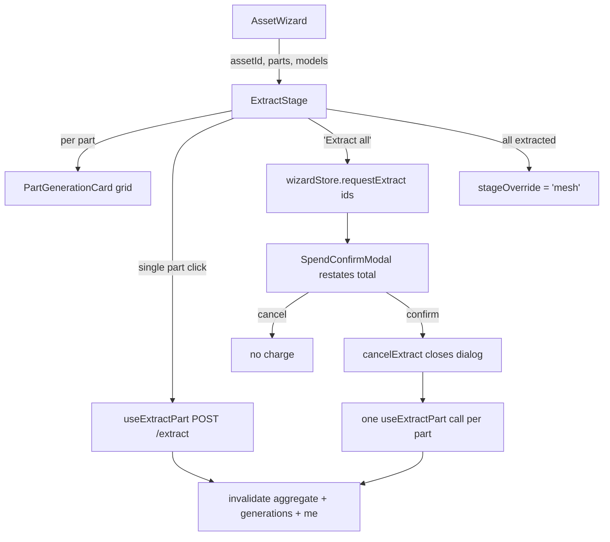

# ExtractStage.tsx — AI component doc

> AI-facing sidecar for `ExtractStage.tsx`. Created 2026-07-20. Keep this in sync with the code on every change.

## Purpose
The wizard's first PAID stage: each part is redrawn isolated on a neutral background so it can be
meshed. One image per part, one charge per image.

## What it does (for an AI reader)
- Responsibilities:
  - Print the per-part price on every button BEFORE the click (`extractionPrice(models)` →
    `PriceTag`); a `null` price DISABLES the button and pulses instead of guessing.
  - Single-part extract = **click-to-spend** (owner decision 2026-07-20 / plan Fix FG-4).
  - Extract-ALL = gated by `SpendConfirmModal`, which restates the TOTAL; the confirm handler closes
    the dialog FIRST and only then mutates.
  - Fire ONE mutation per part so a rejection never aborts its siblings; record rejections in a
    `Map<partId, localizedMessage>`.
  - Offer the forward CTA (`stageOverride='mesh'`) once every part carries an `imageGenerationId`.
- Public API / exports / props / endpoints:
  - `ExtractStage({ assetId, parts, models })`, `ExtractStageProps`
  - Endpoint via hook: `POST /assets3d/:assetId/parts/:partId/extract` (no body)
- Inputs → Outputs: aggregate `parts` + catalog `models` → a priced grid of `PartGenerationCard`s.
- Side effects (I/O, network, state): `useExtractPart` (invalidates the asset aggregate +
  `['generations']` + `['me']`); reads/writes `pendingExtractIds` and `stageOverride` in
  `wizardStore`; each card independently polls its cited generation.

## Dependencies
- Imports / depends on: `shared/ui` (`Button`, `Card`, `EmptyState`), `shared/libs/apiClient`
  (`ApiClientError`), `shared/libs/errorCopy`, `../model/asset3dApi`, `../model/assetPricing`,
  `../model/wizardStore`, `./PartGenerationCard`, `./PriceTag`, `./SpendConfirmModal`.
- Used by: `AssetWizard.tsx` (stage seam).

## Diagram

## Key decisions / gotchas
- The asymmetry with `MeshStage` is deliberate and owner-approved: extraction is the cheap,
  high-repetition step, and a modal per part would push users to batch blindly to escape friction.
- `batchPrice = unitPrice × pendingExtractIds.length`, and is `null` whenever the unit price is —
  which disables the dialog's confirm pill too.
- "Extract all" only offers parts with `imageGenerationId === null`; a re-roll is a per-part act.
- Per-part failures are a `Map`, not a shared string: one rejection must not paint over eleven
  healthy plates.
- A rejected mutation shows a reason with NO refund chip (nothing was charged); a failed
  *generation* shows the reason + refund chip inside `PartGenerationCard`.

## Commits
- _no commit yet_
