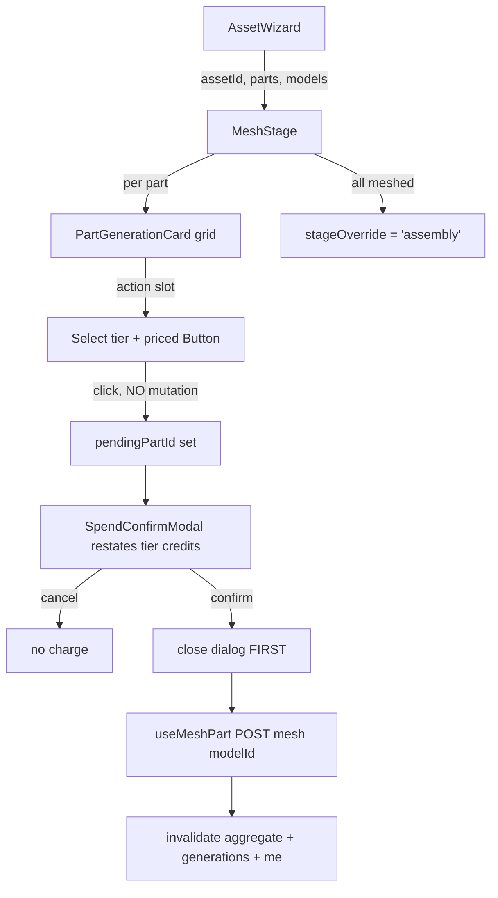

# MeshStage.tsx — AI component doc

> AI-facing sidecar for `MeshStage.tsx`. Created 2026-07-20. Keep this in sync with the code on every change.

## Purpose
The wizard's heaviest paid stage: each extracted part image becomes real geometry on a user-picked
`model3d` tier. One careless tap here can cost more than an entire extraction pass, which is why
every mesh — not just a batch — is confirmed.

## What it does (for an AI reader)
- Responsibilities:
  - Per-part TIER picker (`Select` from `meshTierOptions(models)`, price carried in the row `meta`)
    and a priced button whose number moves with the choice (`meshPrice(models, tierId)`).
  - **Gate EVERY single-part mesh behind `SpendConfirmModal`** (owner decision 2026-07-20,
    superseding the plan's original batch-only note). The bare click only OPENS the dialog; the
    confirm handler closes it FIRST, then mutates.
  - State the reason a part cannot be meshed (`assets3d.mesh.blocked`) instead of showing a dead
    control — the server meshes the EXTRACTED image, so a part with no `imageGenerationId` has no
    input.
  - Offer NO tier and NO spend at all when the catalog carries no `model3d` rows.
  - Record per-part mutation rejections independently (`Map<partId, message>`).
  - Offer the forward CTA (`stageOverride='assembly'`) once every meshable part has a mesh citation.
- Public API / exports / props / endpoints:
  - `MeshStage({ assetId, parts, models })`, `MeshStageProps`
  - Endpoint via hook: `POST /assets3d/:assetId/parts/:partId/mesh` with `{ modelId }` (202 async)
- Inputs → Outputs: aggregate `parts` + catalog `models` → a tiered, priced grid of
  `PartGenerationCard`s.
- Side effects (I/O, network, state): `useMeshPart` (invalidates the asset aggregate +
  `['generations']` + `['me']`); writes `stageOverride` in `wizardStore`; each card polls its cited
  mesh generation to `ready`.

## Dependencies
- Imports / depends on: `shared/ui` (`Button`, `Card`, `EmptyState`, `Select`),
  `shared/libs/apiClient` (`ApiClientError`), `shared/libs/errorCopy`, `../model/asset3dApi`,
  `../model/assetPricing`, `../model/wizardStore`, `./PartGenerationCard`, `./PriceTag`,
  `./SpendConfirmModal`.
- Used by: `AssetWizard.tsx` (stage seam).

## Diagram

## Key decisions / gotchas
- The asymmetry with `ExtractStage` (which is click-to-spend) is deliberate and owner-approved:
  mis-click parity matters more than click economy on the expensive step.
- `MeshStage.test.tsx` pins that the bare click does NOT call the API — the guarantee most likely to
  rot under a later "simplification".
- Tier choice is a per-part `Map` (a hero prop and a background bolt do not deserve the same budget),
  defaulting to `tiers[0]`.
- The empty state covers "no parts" AND "no part extracted yet"; the per-plate `blocked` note is for
  MIXED grids where some siblings are ready and others are not.
- `pendingPartId` derives `pendingPart` from `parts` rather than snapshotting it, so an aggregate
  refetch mid-dialog cannot leave the dialog describing a stale part.

## Commits
- _no commit yet_
