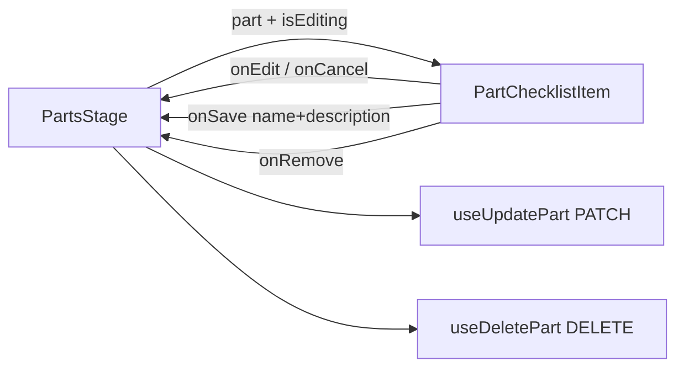

# PartChecklistItem.tsx — AI component doc

> AI-facing sidecar for `PartChecklistItem.tsx`. Created 2026-07-20. Keep this in sync with the code on every change.

## Purpose
One row of the Parts-stage checklist — the part's name/description plus its two acts (rename,
remove). A part's name IS the extraction prompt, so editing it is a first-class affordance rather
than something buried in a menu.

## What it does (for an AI reader)
- Responsibilities:
  - Render a part as either a READ row (name + description + edit/remove pills) or an EDIT row
    (two `Input`s + cancel/save).
  - Hold ONLY the keystrokes of an open edit; the stage owns *which* row is open.
  - Refuse to save an empty name (the contract's `min(1)`) before the round-trip does.
  - Give both action buttons a part-scoped accessible name (`Remove Helmet`, not `Remove` ×12).
- Public API / exports / props:
  - `PartChecklistItem({ part, isEditing, onEdit, onCancel, onSave, onRemove, isBusy })`
  - `PartChecklistItemProps` (exported type)
- Inputs → Outputs: an `Asset3dPart` + edit-mode flag → a row that reports intent upward via
  callbacks. It performs no mutation itself.
- Side effects (I/O, network, state): none (local `useState` edit buffer only).

## Dependencies
- Imports / depends on: `shared/ui` (`Button`, `Input`), `@opencreate/contracts` (`Asset3dPart`),
  `react-i18next`.
- Used by: `PartsStage.tsx`.

## Diagram

## Key decisions / gotchas
- CONTROLLED by the stage (SoulConstructor precedent): analysis can REPLACE the whole part list
  underneath the user, and a row owning its own buffer would keep showing a name for a part the
  server already dropped.
- The stage unmounts the editing branch when it closes a row, so the local buffer cannot survive
  into a stale edit — that is why no `key` reset dance is needed.
- Both pills carry `aria-label` with the part name; the visible glyph (`✕`) is not the accessible
  name.

## Commits
- _no commit yet_
