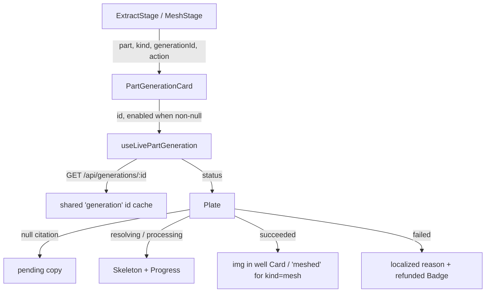

# PartGenerationCard.tsx — AI component doc

> AI-facing sidecar for `PartGenerationCard.tsx`. Created 2026-07-20. Keep this in sync with the code on every change.

## Purpose
One part's plate in a paid grid — shared by the Extraction and Mesh stages, because from the user's
side both are the same shape of wait: I paid, something is rendering upstream, tell me the truth
about it.

## What it does (for an AI reader)
- Responsibilities:
  - RESOLVE the part's cited generation by id (`useLivePartGeneration`) — the aggregate embeds no
    `Generation`, so on a cold load nothing else would populate `['generation', id]`.
  - Render the states of a paid wait: no-citation → resolving Skeleton → `Progress` while
    processing → poster in a `well` plate on success → localized reason + `refunded` Badge on
    failure.
  - Distinguish a failed GENERATION (charged then refunded server-side → refund chip) from a
    rejected MUTATION (`mutationError` — never charged → reason only, no chip).
  - Surface an unreadable poll (`isError && data === undefined`) as an AMBER `role="status"` note,
    not a red failure: nothing failed, we just lost sight of it.
- Public API / exports / props:
  - `PartGenerationCard({ part, kind, generationId, action, mutationError? })`
  - `PartGenerationCardProps`, `PartGenerationKind` (`'extract' | 'mesh'`)
- Inputs → Outputs: an `Asset3dPart` + a cited generation id + a caller-owned `action` node → a
  plate that tells the truth about that citation.
- Side effects (I/O, network, state): `GET /api/generations/:id` polling via
  `useLivePartGeneration` (stop-on-terminal / stop-on-first-error), which itself refreshes
  `['generations']` + `['me']` ONCE on a processing→terminal transition.

## Dependencies
- Imports / depends on: `shared/ui` (`Badge`, `Card`, `Progress`, `Skeleton`),
  `shared/libs/errorCopy`, `@opencreate/contracts` (`Asset3dPart`, `Generation`),
  `../model/partGeneration`.
- Used by: `ExtractStage.tsx`, `MeshStage.tsx`.

## Diagram

## Key decisions / gotchas
- `useLivePartGeneration` is called EXACTLY ONCE and its answer is threaded down as props. It has a
  side effect (the one-shot `['generations']`/`['me']` refresh), so calling it per sub-view would
  fire that refresh once per view.
- `isPending` is guarded by `generationId !== null`: a DISABLED TanStack query is pending forever,
  and without the guard every un-extracted plate would pulse as though work were on its way.
- `kind === 'mesh'` never renders an `` — a mesh's `mediaUrls[0]` is a `.glb`. The mesh plate
  states the outcome and leaves geometry to the Assembly viewer.
- Status is carried by TEXT; color only reinforces (design.md §7).
- Media sits in `Card surface="well" padding="none"` — never `glass` over content the user paid for.

## Commits
- _no commit yet_
