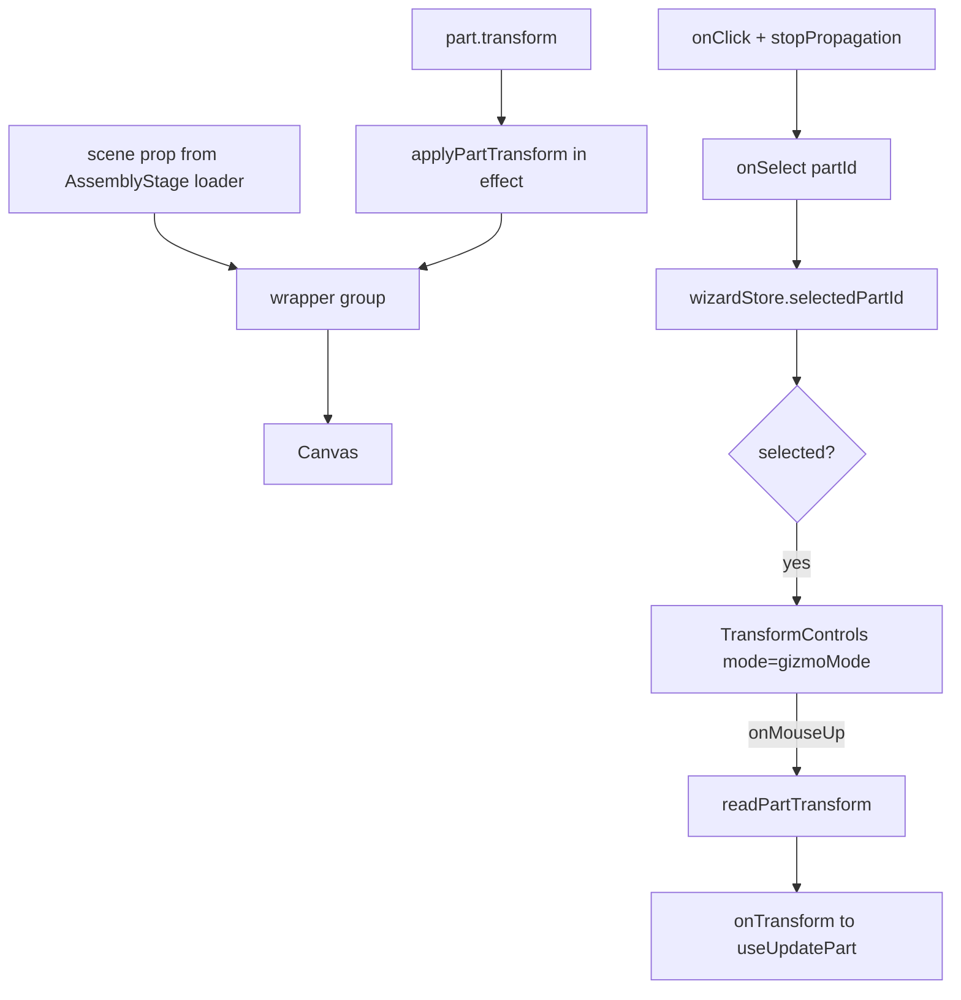

# PartMesh.tsx — AI component doc

> AI-facing sidecar for `PartMesh.tsx`. Created 2026-07-20. Keep this in sync with the code on every change.

## Purpose
ONE part inside the assembly canvas: its loaded GLB scene, placed at the part's saved
transform, plus a drei `TransformControls` gizmo when it is the selected part. A released
drag is PATCHed back to `asset3d_part.transformJson`.

## What it does (for an AI reader)
- Responsibilities: mount a scene at a placement, expose click-to-select, and emit the new
  transform when a gizmo gesture ENDS. It does not load, dispose, or fetch anything.
- Public API / props (`PartMeshProps`):
  - `part: Asset3dPart` — the row's part (its `transform` is the saved placement).
  - `scene: THREE.Group` — the loaded GLB, **owned by AssemblyStage**.
  - `selected: boolean` · `gizmoMode: GizmoMode` (`translate | rotate | scale`).
  - `onSelect(partId)` · `onTransform(partId, transform)`.
- Inputs → Outputs: a scene + a saved transform → a placed object in the canvas; a gizmo
  release → one `PartTransform`.
- Side effects: mutates its own wrapper `<group>`'s matrix via `applyPartTransform`.

## Dependencies
- Imports / depends on: `react`, `@react-three/drei` (`TransformControls`), `three`,
  `../model/partTransform`, `GizmoMode` from `../model/wizardStore`.
- Used by: `AssemblyViewer.tsx`, inside the ONE `<Canvas>`. Reachable only through the
  lazy `AssemblyStage` chunk, so drei never lands in the main bundle.

## Diagram

## Key decisions / gotchas
- **THIS COMPONENT LOADS NOTHING.** The scene arrives as a prop because `AssemblyStage`
  owns `useAssemblyGlbs` for the whole set (`useAssemblyGlb.ts`'s ownership rule). Calling
  the singular loader here too would fetch every GLB twice and double the VRAM the loader
  exists to bound.
- **The group node is held in STATE via a callback ref, not `useRef`.** `TransformControls`
  needs the actual `Object3D` as a prop, and `ref.current` read during render is `null` on
  the first pass — the gizmo would silently never attach until some unrelated re-render
  came along. A callback ref in state re-renders exactly when the node mounts.
- **A WRAPPER group is transformed, never the GLB subtree.** The same `scene` object is
  handed to `exportGlb`; baking a placement into it would make the export and the viewer
  disagree about what "unplaced" means.
- **`applyPartTransform` runs in an effect keyed on `part.transform`, not every render.**
  Mid-drag, three owns the matrix; re-applying the SERVER value each frame would fight the
  cursor and snap the part back.
- **PATCH on gizmo RELEASE (`onMouseUp`), not on change.** The change event fires per frame
  of a drag — wiring the mutation there would send dozens of writes per gesture and pay for
  an aggregate refetch on each.
- **`event.stopPropagation()` on click is required.** Without it the click also reaches every
  part behind this one and the last wins, so selection appears to pick a random part.
- No `.test.tsx`: this component only renders inside a real `<Canvas>`, which is never
  mounted in Vitest. Its logic lives in `partTransform.ts` (16 tests) and its integration is
  covered through `AssemblyStage.test.tsx`'s fallback path.

## Commits
- _no commit yet_
