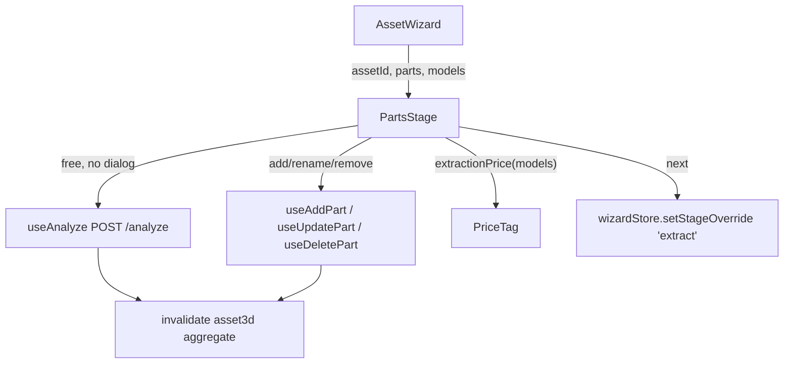

# PartsStage.tsx — AI component doc

> AI-facing sidecar for `PartsStage.tsx`. Created 2026-07-20. Keep this in sync with the code on every change.

## Purpose
The wizard's FREE stage: name what the asset is made of. Nothing is charged here, yet this is where
the money is really spent — a part's name becomes its extraction prompt, so the checklist decides
how well every paid step downstream turns out.

## What it does (for an AI reader)
- Responsibilities:
  - FREE analyse (`useAnalyze`, no body) with **no confirm dialog** — a dialog in front of a
    costless act only trains the click-through reflex the paid stages depend on the user not having.
  - Manual CRUD over parts: add (`useAddPart`), rename/describe (`useUpdatePart`), remove
    (`useDeletePart`); owns which row is open for editing.
  - Cap the add affordance at `MAX_PARTS` (12) and SAY why (VRAM), rather than silently disabling.
  - Degrade a `provider_error` from analyse into an inline "not configured" notice — the wizard must
    stay fully usable on a deployment with no `ANTHROPIC_API_KEY`.
  - Print the extraction price (`extractionPrice(models)` → `PriceTag`) BEFORE the CTA that walks
    the user into the paid half.
- Public API / exports / props / endpoints:
  - `PartsStage({ assetId, parts, models })`, `PartsStageProps`
  - Endpoints via hooks: `POST /assets3d/:id/analyze`, `POST|PATCH|DELETE /assets3d/:id/parts[/:partId]`
- Inputs → Outputs: the wizard's aggregate `parts` + the route's `models` → a checklist and a
  forward CTA that sets `stageOverride='extract'`.
- Side effects (I/O, network, state): the four mutations above (each invalidates `assetKey(assetId)`
  inside `asset3dApi`); writes `stageOverride` in `wizardStore`. It never fetches — the shell owns
  the aggregate's 4 states.

## Dependencies
- Imports / depends on: `shared/ui` (`Button`, `Card`, `EmptyState`, `Input`),
  `shared/libs/apiClient` (`ApiClientError`), `shared/libs/errorCopy`, `@opencreate/contracts`
  (`MAX_PARTS`), `../model/asset3dApi`, `../model/assetPricing`, `../model/wizardStore`,
  `./PartChecklistItem`, `./PriceTag`.
- Used by: `AssetWizard.tsx` (stage seam).

## Diagram

## Key decisions / gotchas
- Analysis is NOT gated by `SpendConfirmModal` — it is free. Only spends get dialogs.
- `analyzeError` maps `provider_error` to the specific actionable copy
  (`assets3d.parts.analyzeUnavailable`); every other code goes through `errorCodeMessageKey`. Raw
  server text is never rendered.
- The add field commits on Enter: making the user reach for the mouse between every part turns a
  12-row checklist into a chore nobody finishes properly.
- The draft name clears only `onSuccess` — a rejected name stays in the field to be fixed.
- Rows are CONTROLLED (`editingPartId` lives here) because analyse can replace the whole list.
- `models` is passed to this otherwise-free stage solely to PRINT the extraction price; the stage
  spends nothing.

## Commits
- _no commit yet_
