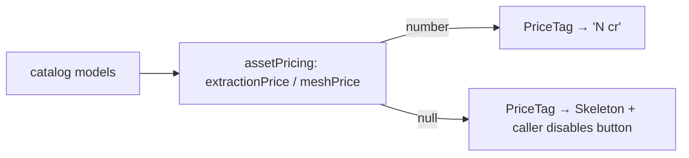

# PriceTag.tsx — AI component doc

> AI-facing sidecar for `PriceTag.tsx`. Created 2026-07-20. Keep this in sync with the code on every change.

## Purpose
The credit price printed ON a paid button, BEFORE the click (design.md §9). It
exists mainly for its `null` branch: an unknown price renders a pulse instead of a
number, and the caller disables the button rather than quote a figure it cannot back.

## What it does (for an AI reader)
- Responsibilities: render `t('assets3d.price', { credits })`, or a `Skeleton` when
  `credits === null`.
- Public API / exports / props / endpoints: `PriceTag`, `PriceTagProps`.
  Props: `credits: number | null`.
- Inputs → Outputs: a nullable credit count (from `assetPricing.ts` off the live
  catalog) → a localized price span, or a pulse.
- Side effects (I/O, network, state): none.

## Dependencies
- Imports / depends on: `react-i18next`, `shared/ui` (`Skeleton`).
- Used by: the wizard's paid surfaces — `ExtractStage` and `MeshStage` buttons, and
  the per-part price printed on the Parts checklist (later builds).

## Diagram

## Key decisions / gotchas
- **`null` is not zero.** Never substitute a fallback number: the catalog is the only
  source of a price, and a guessed one over real credits is a money bug.
- **Deliberate duplicate.** Soul Studio has an identical PRIVATE helper inside
  `SoulSheet.tsx`; it is neither exported nor importable (no cross-module imports).
  Flagged as a `shared/ui` extraction candidate — design.md §10 wants 2+ real
  consumers before promotion, and this is now exactly two.
- Uses the module's own `assets3d.price` key, not `soul.price`, so the two namespaces
  stay independently editable.

## Commits
- _no commit yet_
