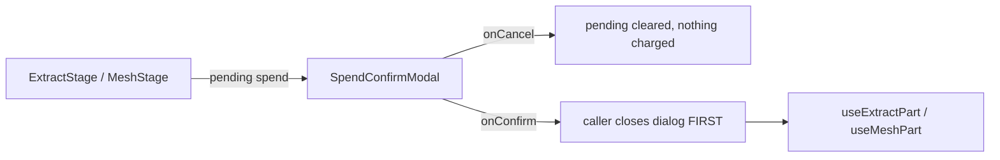

# SpendConfirmModal.tsx — AI component doc

> AI-facing sidecar for `SpendConfirmModal.tsx`. Created 2026-07-20. Keep this in sync with the code on every change.

## Purpose
The single blocking spend primitive of the Assets3D wizard: a `role="alertdialog"` sheet that
restates a credit cost and only spends from its confirm pill. It exists because a credit is not
undoable — design.md §9 requires the number to be said twice before it moves.

## What it does (for an AI reader)
- Responsibilities:
  - Guarantee the SHAPE of a spend moment: restated cost → cancel (free) → confirm (charges).
  - Disable the confirm pill whenever `credits === null` (an unpriceable action must not be
    confirmable; a dialog is the last place to invent a number).
  - Own NO copy. Extraction and meshing describe different sums, so all prose is passed in
    already-localized by the caller.
- Public API / exports / props:
  - `SpendConfirmModal({ isOpen, title, description, confirmLabel, credits, onCancel, onConfirm })`
  - `SpendConfirmModalProps` (exported type)
- Inputs → Outputs: localized strings + a `number | null` price → an accessible alertdialog whose
  confirm pill invokes `onConfirm` exactly once per click.
- Side effects: none. It performs no mutation and touches no query cache — the CALLER closes the
  dialog first, then mutates.

## Dependencies
- Imports / depends on: `shared/ui` (`Modal`, `Button`), `react-i18next` (only for `common.cancel`).
- Used by: `ExtractStage.tsx` (the extract-ALL batch), `MeshStage.tsx` (every single-part mesh —
  owner decision 2026-07-20).

## Diagram

## Key decisions / gotchas
- `role="alertdialog"` not `dialog`: the interruption is deliberate and assistive tech should say so.
- Confirm disabled on `null` price — never a fallback number over real credits.
- The caller closes BEFORE mutating, so the user watches the grid fill in rather than a spinner on a
  dialog they already answered (the SoulSheet precedent).
- Callers must NOT reuse this for the single-part `extract`: that stays click-to-spend by owner
  decision 2026-07-20 (cheap, high-repetition — a dialog per part makes the grid unusable).

## Commits
- _no commit yet_
