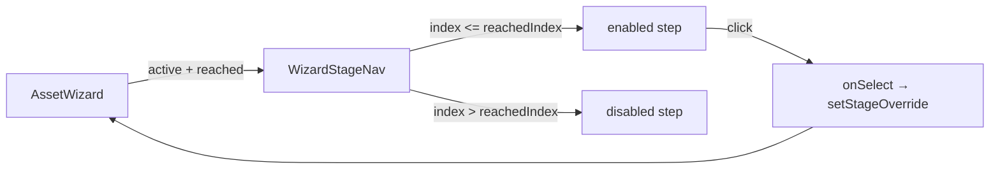

# WizardStageNav.tsx — AI component doc

> AI-facing sidecar for `WizardStageNav.tsx`. Created 2026-07-20. Keep this in sync with the code on every change.

## Purpose
The five-step rail across the top of the asset wizard: it orients the user inside a
five-act process and lets them walk BACK to any stage the asset has already reached.

## What it does (for an AI reader)
- Responsibilities: render the ordered stage list, mark the active step
  (`aria-current="step"` + amber tint), disable stages ahead of `reached`, and call
  `onSelect` for a reachable one.
- Public API / exports / props / endpoints: `WizardStageNav`, `WizardStageNavProps`.
  Props: `active: WizardStage`, `reached: WizardStage`, `onSelect: (stage) => void`.
- Inputs → Outputs: two stage values → an `<ol>` of buttons; a click on a reachable
  step → `onSelect(stage)` (the wizard writes `stageOverride`).
- Side effects (I/O, network, state): none — fully controlled.

## Dependencies
- Imports / depends on: `react-i18next`, `../model/wizardStage` (the `WizardStage` type).
- Used by: `AssetWizard`.

## Diagram

## Key decisions / gotchas
- **`active` and `reached` are two different props on purpose.** `active` is what is
  on screen (possibly an override); `reached` is the furthest the asset's real state
  has got. Deriving reachability from `active` would lock a user who walked back to
  Parts out of returning to Extraction.
- **Steps are BUTTONS, not links.** The stage is derived state, not a route — a link
  would promise a URL that does not exist (one `$assetId` route owns all five stages).
- **Stages ahead are disabled, not hidden.** Hiding them would destroy the
  orientation job; letting them be clicked would drop the user on an empty screen
  they would read as a bug.
- Status is never color-only: `aria-current="step"` carries "you are here" and the
  amber specimen tint only reinforces it.
- `STAGES` is the local flow order and must stay identical to the order `deriveStage`
  walks in `wizardStage.ts`.

## Commits
- _no commit yet_
