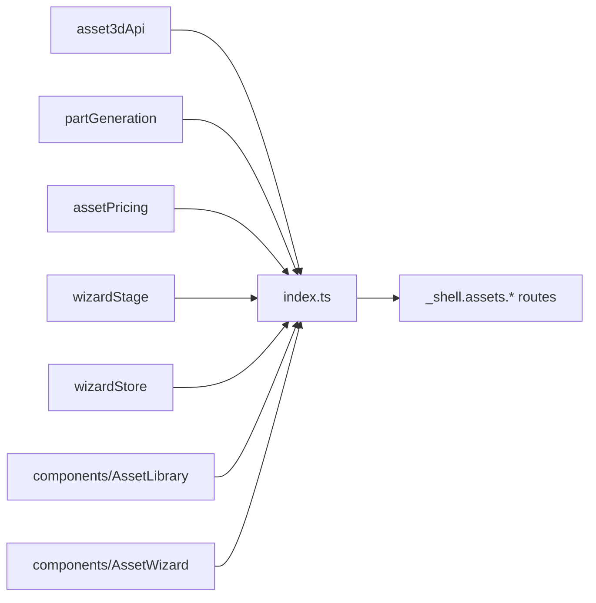

# index.ts — AI component doc

> AI-facing sidecar for `index.ts`. Created 2026-07-18. Keep this in sync with the code on every change.

## Purpose
Public API barrel of the Modular 3D Assets module (ADR modular-3d-assets). Routes
and the module's own components import ONLY from `modules/Assets3D`; the `model/`
files and the inner `components/` stay private behind this barrel. It now exposes
BOTH the data layer and the module's two screens.

## What it does (for an AI reader)
- Responsibilities: expose the module's data layer as its public surface — the
  server-state hooks, the live-generation hooks, and the two pure helpers.
- Public API / exports:
  - From `asset3dApi`: `assetKey`, `useAssets`, `useAsset`, `useCreateAsset`,
    `useUpdateAsset`, `useDeleteAsset`, `useAnalyze`, `useAddPart`, `useUpdatePart`,
    `useDeletePart`, `useExtractPart`, `useMeshPart`.
  - From `partGeneration`: `GENERATION_POLL_MS`, `partPollInterval`,
    `useLivePartGeneration`, `useLivePartGenerations`.
  - From `assetPricing`: `extractionPrice`, `meshTierOptions`, `meshPrice`, `type MeshTierOption`.
  - From `wizardStage`: `deriveStage`, `type WizardStage`.
  - From `wizardStore`: `useWizardStore`, `type GizmoMode`, `type WizardUiState`.
  - **Screens**: `AssetLibrary` (the `/assets` body) and `AssetWizard` +
    `type AssetWizardProps` (the `/assets/:assetId` shell).
- Inputs → Outputs: re-exports only.
- Side effects: none.

## Dependencies
- Imports / depends on: the `model/` files and the two screen components.
- Used by: `routes/_shell.assets.index.tsx` and `routes/_shell.assets.$assetId.tsx`.

## Diagram

## Key decisions / gotchas
- **Only the two SCREENS are exported, not the stage components.** `AssetCard`,
  `CreateAssetModal`, `PriceTag`, `WizardStageNav`, `AssemblyStage` and the later
  stage bodies stay private — a route has no business mounting a wizard stage
  directly, and keeping them internal is what lets them be restructured freely.
- `useWizardStore` is exported for the module's own stage components (deep imports
  are banned even inside a module's public API discipline); routes never touch it.
- No cross-module imports anywhere in the module — other modules are reached only
  through the shared query cache, and the catalog arrives as a prop from the route.

## Commits
- _no commit yet_
