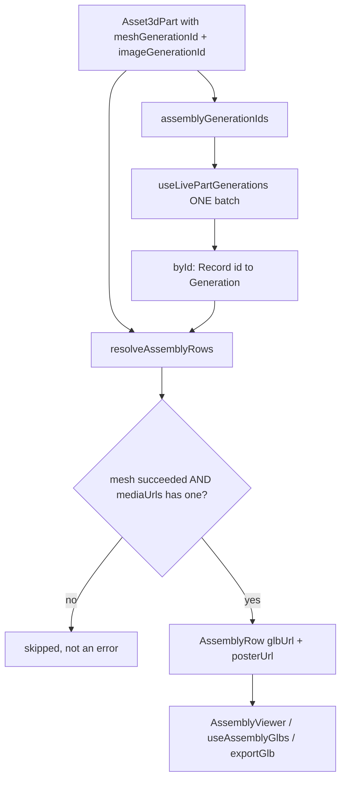

# assemblyRows.ts — AI component doc

> AI-facing sidecar for `assemblyRows.ts`. Created 2026-07-20. Keep this in sync with the code on every change.

## Purpose
PURE resolution of "which parts can actually be assembled, and from what url" (plan
Fix FG-3). It is the single place that turns a part's `meshGenerationId` **citation**
into a real GLB url, and the single place that decides a part must be skipped.

## What it does (for an AI reader)
- Responsibilities: collect the generation ids an assembly needs, count mesh citations,
  and build the placeable rows. No fetching, no rendering, no three.js.
- Public API / exports:
  - `type AssemblyRow = { part: Asset3dPart; glbUrl: string; posterUrl: string | null }`.
  - `assemblyGenerationIds(parts): string[]` — mesh + image citations, for ONE batch query.
  - `meshCitationCount(parts): number` — how many parts cite a mesh at all.
  - `resolveAssemblyRows(parts, byId): AssemblyRow[]` — the placeable rows, in parts order.
- Inputs → Outputs: `Asset3dPart[]` + `Record<string, Generation>` → rows.
- Side effects: none (pure).

## Dependencies
- Imports / depends on: `Asset3dPart` / `Generation` types from `@opencreate/contracts`. Nothing else.
- Used by: `AssemblyStage.tsx` (builds the batch query and the viewer rows);
  `AssemblyViewer.tsx` / `PartMesh.tsx` consume `AssemblyRow` as a type.

## Diagram

## Key decisions / gotchas
- **THE BUG THIS PREVENTS:** a part cites its mesh by ID; the GLB's `/media/*` path lives
  on THAT generation's `mediaUrls[0]`. Deriving a url from the bare id
  (`/media/${meshGenerationId}.glb`) looks right and is wrong — the id is not the
  filename, and a still-processing or failed generation has no file at all. A test pins
  that the url and the id are unrelated strings.
- **Four different "no GLB" causes collapse to one behaviour: SKIP.** Processing, failed,
  unresolved, and succeeded-with-empty-`mediaUrls` are all skips, never errors. The
  `useShotGenerations` precedent: return only playable rows.
- **`posterUrl` comes from the IMAGE generation, never the mesh.** A mesh's `mediaUrls[0]`
  is the GLB itself, which no `` can display. A part with an unresolved poster is
  still placeable — the mesh is what makes it placeable, the poster only feeds the
  no-WebGL fallback tile.
- **`meshCitationCount` exists to separate two states that need different copy:** "nothing
  has been meshed yet" (`assets3d.assembly.noMesh`) vs "meshes exist but none finished"
  (`assets3d.assembly.noneReady`). Without it the stage would show one vague sentence.
- Null citations are dropped rather than stringified — `/api/generations/null` must never
  be requested.
- Extracted from `AssemblyStage` deliberately: every skip rule is a branch worth a unit
  test, and testing them through a rendered component would need a network mock per case.

## Commits
- _no commit yet_
