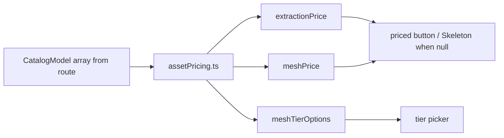

# assetPricing.ts — AI component doc

> AI-facing sidecar for `assetPricing.ts`. Created 2026-07-18. Keep this in sync with the code on every change.

## Purpose
Pure price model for the two paid steps of the Modular 3D Assets wizard (extract +
mesh). It mirrors the server's model rule ONLY to print the price on a button
BEFORE the click (design.md §9), with no network and no side effects.

## What it does (for an AI reader)
- Responsibilities: derive the credit price of the extraction step and each mesh
  tier from the live catalog, returning `null` (never 0, never a guess) when the
  catalog is missing the relevant model — a null price disables the button.
- Public API / exports / props / endpoints:
  - `extractionPrice(models): number | null` — credits of the reference-capable
    image model (`type:'image'` + `referenceMode`), the same discriminator the API's
    `pickExtractionModel` uses; `null` if none.
  - `meshTierOptions(models): MeshTierOption[]` — the `model3d` rows for the tier
    picker (`{ value, label, credits }`), in catalog order.
  - `meshPrice(models, modelId): number | null` — flat price of the picked
    `model3d` tier; `null` for an unknown or non-`model3d` id.
  - `type MeshTierOption`.
- Inputs → Outputs: `CatalogModel[]` (read at the route via `useCatalog`) → numbers /
  option rows.
- Side effects: none (pure).

## Dependencies
- Imports / depends on: `@opencreate/contracts` (`CatalogModel`) only.
- Used by: the (later) Extract/Mesh stage components and `SpendConfirmModal`; the
  catalog is passed down from the route (the `/create` seam), never imported cross-module.

## Diagram

## Key decisions / gotchas
- `null`, never `0` or a fallback: a guessed number over real credits is a money bug.
- The extraction model is selected by the `referenceMode` discriminator, not a
  hardcoded id, so a catalog re-price or model swap moves the printed number automatically.
- Union members are narrowed with `Extract<CatalogModel, { type }>` so `.credits`
  is type-safe (video models price via `creditsByDuration`, not `credits`).

## Commits
- _no commit yet_
