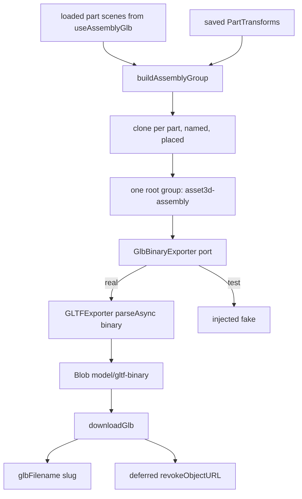

# exportGlb.ts — AI component doc

> AI-facing sidecar for `exportGlb.ts`. Created 2026-07-20. Keep this in sync with the code on every change.

## Purpose
Merges the assembled parts into ONE downloadable `.glb` (ADR `modular-3d-assets` D4:
"Export = client-side `GLTFExporter` over the assembled group"). This is the payoff of the
whole wizard — the artifact the user paid per part to obtain.

## What it does (for an AI reader)
- Responsibilities: clone each ready part's scene, bake its transform, group them under one
  named root, write binary glTF, and (separately) trigger the browser download.
- Public API / exports:
  - `type AssemblyExportPart = { name: string; scene: THREE.Object3D; transform: PartTransform | null }`.
  - `ASSEMBLY_GROUP_NAME` — root node name in the exported file.
  - `buildAssemblyGroup(parts): THREE.Group` — the export graph; non-destructive.
  - `type GlbBinaryExporter = (root: THREE.Object3D) => Promise<ArrayBuffer>` — injectable port.
  - `gltfBinaryExporter: GlbBinaryExporter` — the real `GLTFExporter` writer (`binary: true`).
  - `exportAssemblyGlb(parts, exporter?): Promise<Blob>` — assemble + write; throws on 0 parts.
  - `glbFilename(title): string` — filesystem-safe download name.
  - `downloadGlb(blob, filename): void` — the only DOM-touching step.
- Inputs → Outputs: resolved part scenes (from `useAssemblyGlb.ts`) + saved transforms →
  a `model/gltf-binary` Blob → a file on the user's disk.
- Side effects: `downloadGlb` creates an object URL, appends/clicks/removes an anchor, and
  revokes the URL on a deferred task. Everything else is in-memory.

## Dependencies
- Imports / depends on: `three`, `three/examples/jsm/exporters/GLTFExporter.js`,
  `PartTransform` from `@opencreate/contracts`, and `./partTransform` (`applyPartTransform`).
- Used by: `AssemblyStage.tsx` (the export button). Lives behind the `React.lazy` boundary
  so `GLTFExporter` stays out of the main chunk.

## Diagram

## Key decisions / gotchas
- **Export operates on CLONES.** The scenes passed in are the ones the live `<Canvas>` is
  rendering this frame. Transforming them in place would make every part visibly jump the
  moment the user clicked Export, and would corrupt the placements queued for PATCH.
- **NEVER dispose the exported group.** three's `clone()` SHARES geometries, materials and
  textures with the live scene by reference — deliberately, since the exporter only reads
  them and duplicating 12 parts' textures would be exactly the VRAM spike the viewer
  contract exists to avoid. Disposing the clone would free the LIVE viewer's GPU resources
  out from under it. That memory is owned by `useAssemblyGlb.ts`, which loaded it.
- **`group.updateMatrixWorld(true)` is mandatory.** `GLTFExporter` reads matrices; without
  it every part exports stacked at the origin.
- **Part names become node names**, i.e. what appears in Blender's outliner. An unnamed
  merge is just a mesh — naming is the entire point of a MODULAR asset.
- **The binary writer is a port** (renderTurntable's `TurntableFrameSink` precedent): it
  keeps the group assembly — the part with all the logic — provable in jsdom without
  running a binary writer, and keeps the format swappable if USDZ/FBX lands.
- **`parseAsync` is narrowed with `instanceof ArrayBuffer`, not asserted.** Its type is
  `ArrayBuffer | object` because the same method writes JSON glTF; a JSON result would mean
  `binary` was lost, and shipping that as `.glb` produces a file no DCC tool can open.
- **0 parts throws** rather than writing an empty file: a GLB with no meshes opens silently
  blank in Blender, which reads as breakage long after the fact. The stage shows a calm
  error for that state instead.
- **`revokeObjectURL` is DEFERRED (`setTimeout 0`), not immediate.** Revoking in the same
  task can cancel the download before the browser has read the blob (Safari in particular).
  It must still happen — an un-revoked url pins the whole multi-MB GLB for the life of the
  document.
- The anchor is appended to the document because Firefox ignores `click()` on a detached one.
- `glbFilename` collapses everything outside `[a-z0-9]` to a single dash: one rule covering
  the Windows-illegal set (`\ / : * ? " < > |`) and shell-hostile characters, instead of a
  blocklist that will miss one. Emoji/CJK-only titles fall back to `asset.glb`.

## Commits
- _no commit yet_
