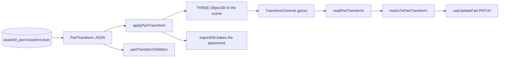

# partTransform.ts — AI component doc

> AI-facing sidecar for `partTransform.ts`. Created 2026-07-20. Keep this in sync with the code on every change.

## Purpose
PURE bridge between the stored `PartTransform` (ADR `modular-3d-assets` D4, contract
`packages/contracts/src/asset3d.ts`) and three.js. The one place that knows how the JSON
in `asset3d_part.transformJson` becomes a placement in the assembly scene — and back out
again for the PATCH.

## What it does (for an AI reader)
- Responsibilities: compose/decompose a transform, place an `Object3D`, read one back.
  It does NOT load, render, fetch or mutate server state.
- Public API / exports:
  - `IDENTITY_TRANSFORM: PartTransform` — deeply frozen origin/unit-scale default,
    meaning "never placed".
  - `partTransformToMatrix(transform): THREE.Matrix4` — stored JSON → composed matrix.
  - `matrixToPartTransform(matrix): PartTransform` — matrix → plain number tuples, ready
    to serialise into the PATCH body.
  - `applyPartTransform(object, transform | null): void` — place an object; `null` resets
    to identity.
  - `readPartTransform(object): PartTransform` — read an object's LOCAL placement back.
- Inputs → Outputs: `PartTransform` ↔ `THREE.Matrix4` / `THREE.Object3D`. No I/O.
- Side effects: `applyPartTransform` mutates the passed `Object3D` (position/rotation/
  scale + `updateMatrix`/`updateMatrixWorld`); `readPartTransform` calls `updateMatrix()`
  on it. Module-level scratch `Vector3`/`Quaternion`/`Euler` are reused across calls.

## Dependencies
- Imports / depends on: `three`, and `PartTransform` from `@opencreate/contracts` (type
  only). No React, no network, no module-local imports.
- Used by: `PartMesh.tsx` (apply on mount, read on gizmo release → `useUpdatePart`) and
  `exportGlb.ts` (bake each cloned part's placement before the merge).

## Diagram

## Key decisions / gotchas
- **The convention IS the contract:** Y-up, metres (glTF), rotation as **Euler XYZ in
  RADIANS**, free (non-uniform) vec3 scale. Degrees would fail quietly — a part 1.57° off
  instead of 90°, which reads as "the gizmo barely moved" rather than an obvious break.
- **Everything routes through a `Matrix4`, never `object.rotation` directly.** drei's
  `TransformControls` drives the QUATERNION; `object.rotation` is only its projection
  under whatever Euler order that node carries. The same three numbers mean a DIFFERENT
  pose under `YXZ` than under `XYZ`, so reading the euler field would silently store wrong
  angles for any GLB node with a non-default order. `applyPartTransform` therefore also
  PINS `rotation.order = 'XYZ'` before setting the angles.
- **`'XYZ'` is passed explicitly, never defaulted.** three's default happens to match, but
  a future release changing it must not re-interpret already-stored user data.
- **`applyPartTransform` calls `updateMatrix()` + `updateMatrixWorld(true)`.** `GLTFExporter`
  reads matrices; leaving them stale exports every part stacked at the origin — a merged
  GLB that looks nothing like the viewer the user just arranged.
- **`null` means reset, not "leave it".** A cleared transform must not let a stale
  placement survive.
- `IDENTITY_TRANSFORM` is annotated first and frozen field-by-field: freezing the tuple
  literals inline widens them to `readonly number[]`, which no longer satisfies the
  contract's fixed-length `vec3` — and a cast to paper over that is not how this codebase
  handles types. Deep-frozen because it is a shared default handed to every unplaced part.
- Module-level scratch objects avoid per-frame GC churn during a gizmo drag. Safe because
  the module is single-threaded and never holds them across an `await`.
- Genuinely generic (nothing here is Assets3D-specific) → a LATER `shared/` extraction
  candidate. NOT extracted now: cross-module imports are forbidden and the plan says flag,
  don't hoist.

## Commits
- _no commit yet_
