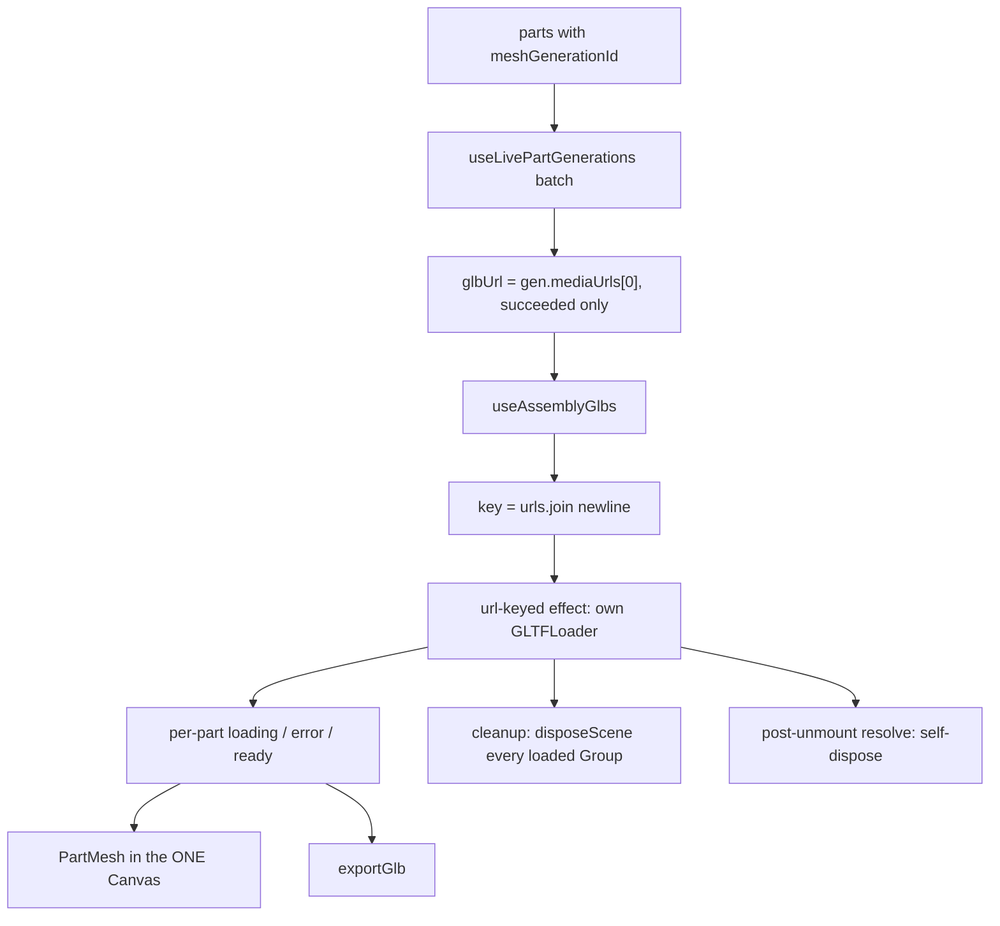

# useAssemblyGlb.ts — AI component doc

> AI-facing sidecar for `useAssemblyGlb.ts`. Created 2026-07-20. Keep this in sync with the code on every change.

## Purpose
Loads the assembly stage's part GLBs and OWNS THEIR GPU MEMORY (ADR `modular-3d-assets`
D4, which adopts `photo-to-3d-studio` D6 verbatim). It is the VRAM contract for the whole
Assets3D viewer: nothing else in the module may load a GLB.

## What it does (for an AI reader)
- Responsibilities: fetch N part GLBs with its OWN `GLTFLoader` in a content-keyed effect,
  expose per-part load state, and dispose every geometry/material/texture it created —
  on unmount, on url change, and on a post-unmount resolve.
- Public API / exports:
  - `type GlbState = { status: 'loading'; progress: number } | { status: 'error'; message: string } | { status: 'ready'; scene: THREE.Group }`.
  - `disposeScene(root: THREE.Object3D): void` — release every GPU resource in a graph.
  - `useAssemblyGlbs(urls: string[]): GlbState[]` — **primary**; one state per url, in order.
  - `useAssemblyGlb(url: string): GlbState` — thin projection of the batch hook, for `PartMesh`.
- Inputs → Outputs: resolved `/media/*.glb` urls (from each part's mesh generation's
  `mediaUrls[0]` — never a bare `meshGenerationId`) → per-part `GlbState`.
- Side effects: network fetch per url via `GLTFLoader`; allocates and frees GPU resources;
  React state updates per part.

## Dependencies
- Imports / depends on: `react`, `three`, `three/examples/jsm/loaders/GLTFLoader.js`. No
  network client, no query cache, no other module.
- Used by: `AssemblyViewer.tsx` / `PartMesh.tsx` (mount the parts) and `AssemblyStage.tsx`
  (feed resolved scenes to `exportGlb.ts`).

## Diagram

## Key decisions / gotchas
- **NEVER drei's GLTF suspense-cache hook.** It caches by URL and never frees VRAM — its
  cache-clear helper drops the JS entry only; geometries, materials and textures stay
  resident on the GPU. Correct upstream for five fixed models; a monotonically growing leak
  for our per-user, per-generation (unbounded) urls. Terminal symptom is WebGL context
  loss. The identifier is spelled out in `Studio3D/model/useGlb.ts` and deliberately kept
  out of this module so the FG8 verification grep for real usages stays meaningful.
- **Assembly is sharper than Studio3D:** Studio3D shows ONE model, assembly holds up to
  `MAX_PARTS` (12) in a single `<Canvas>` while the user re-rolls part meshes in place.
- **COPIED FROM, NOT IMPORTED FROM, `Studio3D/model/useGlb.ts`** — cross-module imports are
  forbidden. `disposeScene` and the singular hook are near-identical to Studio3D's and are
  a genuine LATER `shared/` extraction candidate. Flagged, not hoisted.
- **Duck-typed `GpuOwner`, not `instanceof Mesh`.** glTF POINTS/LINES primitives are not
  Meshes; an `instanceof` check walks past them and leaks their buffers — silently, and
  only on assets that contain them. Covered by a test.
- **Textures are enumerated via `Object.values` BEFORE `material.dispose()`.** Disposing the
  material drops its texture slots, so enumerating afterwards finds nothing and leaves the
  expensive half resident. Ordering is asserted by a test.
- **Reset happens DURING RENDER, not in the effect** (React "Adjusting some state when a
  prop changes"). Resetting in the effect commits one frame in which the caller still holds
  the PREVIOUS Groups — the ones cleanup is about to dispose — so the viewer would paint
  against freed GPU buffers.
- **The effect keys on the JOINED urls, not the array identity.** `AssemblyStage` rebuilds
  the array from the parts query every render; an identity-keyed effect would re-download
  every GLB each time. The urls are carried alongside the key because the key alone cannot
  distinguish `[]` from `['']`.
- **A post-unmount resolve disposes itself.** Once the effect is gone there is no reference
  left to free that scene by.
- **Per-part failure is never fatal to the batch** — same rule as the paid stages.
- **OWNERSHIP RULE for whoever wires the components:** the component that calls a hook here
  owns those scenes' VRAM until unmount. Do NOT call `useAssemblyGlbs` in `AssemblyStage`
  AND `useAssemblyGlb` in each `PartMesh` for the same urls — that loads every GLB twice and
  doubles the VRAM this file exists to bound. Pick one owner; pass scenes down as props.
- `LOAD_FAILED` is a stable internal marker, never shown to a user; the UI renders a
  localized string off `status === 'error'`.

## Commits
- _no commit yet_
