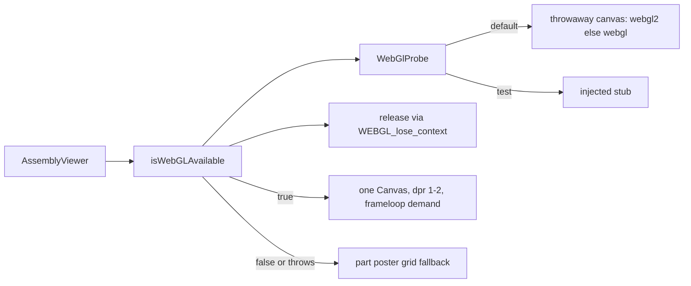

# webglSupport.ts — AI component doc

> AI-facing sidecar for `webglSupport.ts`. Created 2026-07-20. Keep this in sync with the code on every change.

## Purpose
The no-WebGL fallback gate for the assembly viewer (ADR `photo-to-3d-studio` D6, applied
verbatim by `modular-3d-assets` D4). Answers "can this browser render the `<Canvas>` at
all?" BEFORE the assembly stage mounts one, so a machine without WebGL gets the poster
grid instead of a crashed wizard.

## What it does (for an AI reader)
- Responsibilities: probe for a WebGL context, release the probe immediately, and never
  throw. Nothing else — it does not render, cache, or remember the answer.
- Public API / exports:
  - `type WebGlProbeContext = { getExtension: (name: string) => unknown }` — the single
    slice of a context this gate touches; both `WebGLRenderingContext` and
    `WebGL2RenderingContext` satisfy it structurally.
  - `type WebGlProbe = () => WebGlProbeContext | null` — the injectable port.
  - `canvasWebGlProbe: WebGlProbe` — the real probe: throwaway `<canvas>`, `webgl2` then
    `webgl`. Returns `null` when `document` is absent (SSR/prerender) or no context exists.
  - `isWebGLAvailable(probe = canvasWebGlProbe): boolean` — the gate.
- Inputs → Outputs: an optional probe → a boolean. Default call site is `isWebGLAvailable()`.
- Side effects: creates one detached `<canvas>` per call and asks it for a context, then
  releases that context via `WEBGL_lose_context`. Nothing is mounted or retained.

## Dependencies
- Imports / depends on: nothing (DOM lib types only). No three.js — deliberately, so the
  gate can be evaluated OUTSIDE the lazy three.js chunk if a caller ever needs to.
- Used by: `AssemblyViewer.tsx` (choose `<Canvas>` vs poster fallback) and
  `AssemblyStage.test.tsx`, whose no-WebGL assertion depends on this returning `false`
  in jsdom.

## Diagram

## Key decisions / gotchas
- **The probe context MUST be released.** Browsers cap live WebGL contexts at ~8-16 and
  silently kill the oldest past the cap. A gate that leaked its probe on every call would
  evict the viewer's own canvas — precisely the context loss it exists to prevent.
- **The probe is a port, not an inlined `document.createElement`.** Same reasoning as
  `Studio3D/model/renderTurntable.ts`'s `TurntableFrameSink`: jsdom has no WebCodecs and
  no WebGL, so injecting the capability is what makes every branch testable — and it
  avoids faking a 300-member `WebGLRenderingContext` with a cast.
- **Two independent `try` blocks.** A throwing `getContext` (blocked-canvas privacy modes,
  hardened builds) means unsupported → `false`. A throwing `loseContext` means the context
  WAS created → still `true`; only the early slot release was lost. Collapsing these into
  one `try` would misreport a working GPU as unsupported.
- `WEBGL_lose_context` returns `unknown` and is narrowed by `isLoseContextExtension`, not
  asserted — the module has zero `any` and zero `as` casts.
- Not memoized on purpose: it is called once per viewer mount, and caching would hide a
  context that was lost between mounts.
- Generic enough to be a LATER `shared/` extraction candidate (Studio3D has no probe of
  its own yet and would want the same one). NOT extracted now — cross-module imports are
  forbidden and the plan says flag, don't hoist.

## Commits
- _no commit yet_
