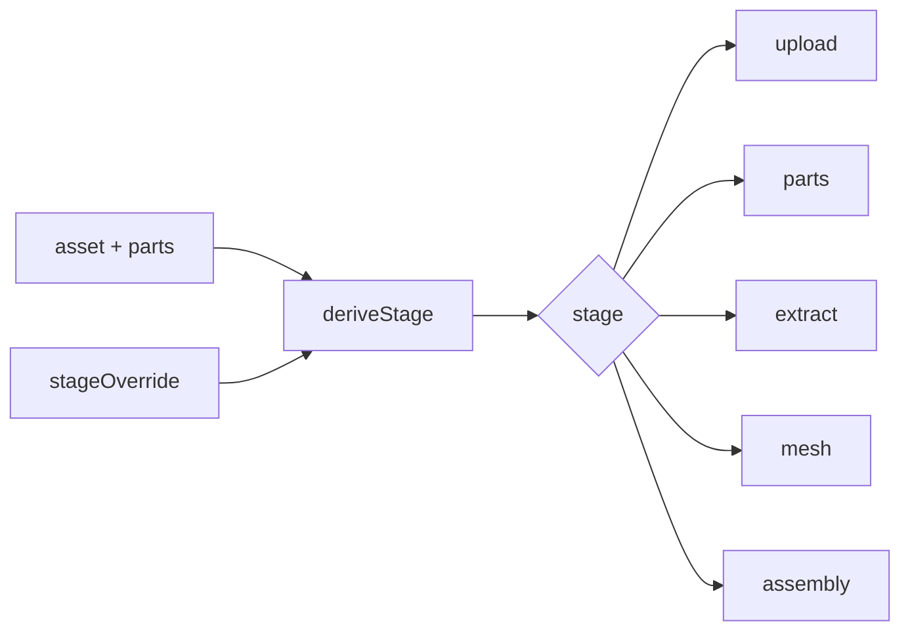

# wizardStage.ts — AI component doc

> AI-facing sidecar for `wizardStage.ts`. Created 2026-07-18. Keep this in sync with the code on every change.

## Purpose
Pure stage derivation for the linear 3D-assets wizard (ADR D6). The wizard is one
`$assetId` route whose component derives the active stage from the loaded asset +
parts state; keeping that logic pure and here makes every transition unit-testable.

## What it does (for an AI reader)
- Responsibilities: map `(asset, parts, override?)` to the active `WizardStage`,
  sitting at the FURTHEST-BACK incomplete stage so one still-draft part keeps the
  user on Parts even if siblings are meshing.
- Public API / exports:
  - `type WizardStage = 'upload' | 'parts' | 'extract' | 'mesh' | 'assembly'`.
  - `deriveStage(asset, parts, override?): WizardStage` — order of checks IS the flow:
    null asset → upload; no parts / any `draft` → parts; any `extracting`/`extracted`
    → extract; any `meshing` → mesh; all `ready` → assembly. A non-null `override`
    (manual back-nav to a completed stage) wins.
- Inputs → Outputs: `Asset3d | null`, `Asset3dPart[]`, optional override → a stage string.
- Side effects: none (pure).

## Dependencies
- Imports / depends on: `@opencreate/contracts` (`Asset3d`, `Asset3dPart`) only.
- Used by: the (later) `AssetWizard` shell to pick which stage component to render,
  and `WizardStageNav` for the rail; the override comes from the wizard's Zustand UI store.

## Diagram

## Key decisions / gotchas
- Check order encodes furthest-back-incomplete: `extract` is tested BEFORE `mesh`,
  so an extracted part gates the wizard even while a sibling meshes.
- `override != null` (not truthy) so a valid stage string always wins; `null`/absent
  falls through to derivation.
- Status is the DERIVED part status from the read DTO — this file never recomputes
  it from citations.

## Commits
- _no commit yet_
