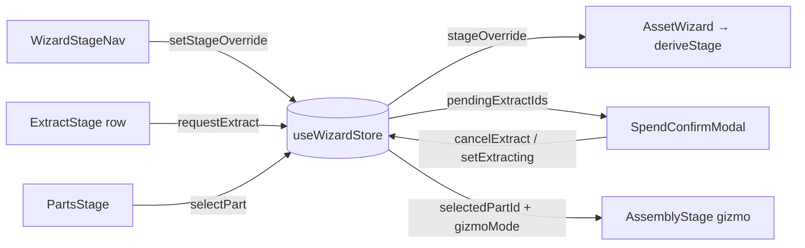

# wizardStore.ts — AI component doc

> AI-facing sidecar for `wizardStore.ts`. Created 2026-07-20. Keep this in sync with the code on every change.

## Purpose
Zustand store holding the Modular-3D-Assets wizard's LOCAL UI state — selection,
manual stage back-nav, the pending spend set, in-flight pulses and the gizmo mode.
Server state (asset, parts, derived statuses, cited generations) stays in TanStack
Query; this file is the deliberate complement, not a mirror.

## What it does (for an AI reader)
- Responsibilities: hold the facts the server has no opinion about, so sibling
  components (stage rail ↔ stage body, checklist ↔ gizmo, grid row ↔ spend modal)
  can share them without the wizard shell becoming a prop bus for state it does not
  itself use.
- Public API / exports / props / endpoints:
  - `type GizmoMode = 'translate' | 'rotate' | 'scale'`
  - `type WizardUiState` — the full state + action surface
  - `useWizardStore` — the store hook (module singleton)
- State: `selectedPartId`, `stageOverride`, `pendingExtractIds`, `extractingIds`,
  `meshingIds`, `gizmoMode`.
- Actions: `selectPart`, `setStageOverride`, `requestExtract`, `cancelExtract`,
  `setExtracting`, `setMeshing`, `setGizmoMode`, `reset`.
- Inputs → Outputs: user gestures → UI flags read by the stage components.
- Side effects (I/O, network, state): none — no network, no persistence, no timers.

## Dependencies
- Imports / depends on: `zustand`, and `./wizardStage` for the `WizardStage` type only.
- Used by: `AssetWizard` (resets on asset change, reads `stageOverride`),
  `WizardStageNav` (writes `stageOverride`), and — in later builds — `PartsStage`,
  `ExtractStage`, `MeshStage`, `AssemblyStage`.

## Diagram

## Key decisions / gotchas
- **ONE `selectedPartId`, not one per stage.** The checklist, the extraction grid and
  the assembly gizmo all answer "which part am I on" and are never on screen together;
  a second field would only let two selections silently disagree.
- **`pendingExtractIds !== null` IS the spend dialog's open state** (SoulSheet's
  `pendingViews` precedent) — the dialog and the about-to-be-charged set cannot drift
  apart, because they are the same value.
- **`extractingIds`/`meshingIds` are optimistic PULSE only.** The truth of "is this
  part extracting" is the part's DERIVED status from the server. They exist purely for
  the gap between the click and the aggregate refetch. Never branch money or
  correctness on them.
- **`reset()` exists because the store is a module singleton and the route param is
  not.** `AssetWizard` resets on a change of `assetId`, so a selection or an open spend
  dialog cannot leak from one asset into the next.
- `INITIAL` is a separate `satisfies`-checked object so `reset` can never drift from
  the initializer.

## Commits
- _no commit yet_
