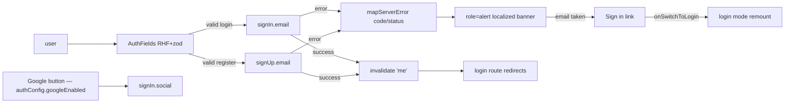

# AuthForm.tsx — AI component doc

> AI-facing sidecar for `AuthForm.tsx`. Created 2026-07-06. Keep this in sync with the code on every change.

## Purpose

The login/registration form rendered on `/login` inside the route's centered
STEEL card (stage-3 v3 treatment — mono weight-400 30px heading over a hairline):
one component for both modes with RHF + zod validation and an optional env-gated
Google button. The submit pill is tinted by mode per the reference taxonomy
(log-in = red specimen pill, sign-up = green specimen pill).

## What it does (for an AI reader)

- Responsibilities: collect email/password (+ name in register mode), validate via zod,
  call `signIn.email` / `signUp.email`, map server errors to ACTIONABLE localized alert
  copy (by better-auth code, HTTP status as fallback), and on an email-already-registered
  sign-up offer an inline switch-to-login shortcut; invalidate `['me']` on success.
- Public API / exports / props / endpoints: `AuthForm` (no props). Private `AuthFields`
  subcomponent (props: `mode`, `onSwitchToLogin`) remounted per mode via `key={mode}`.
- Inputs → Outputs: user keystrokes → better-auth calls → session cookie set by the API;
  UI states: idle form, submitting (button spinner), field errors (`role="alert"` per
  input), server error banner (`role="alert"`), success (session change → route redirects).
- Side effects (I/O, network, state): POST `/api/auth/sign-in/email` /
  `/api/auth/sign-up/email`; OAuth redirect via `signIn.social` (google);
  `queryClient.invalidateQueries(['me'])`.

## Dependencies

- Imports / depends on: `react-hook-form`, `@hookform/resolvers/zod`, `zod`,
  `react-i18next`, `@tanstack/react-query`, `shared/ui` (Button, Input),
  `../model/authClient`.
- Used by: `routes/login.tsx` via `modules/Auth` index.

## Diagram

## Key decisions / gotchas

- zod messages are i18n KEYS (`auth.errors.*`) translated at render — copy switches
  locale live without re-validating.
- Mode switch remounts the fields (`key={mode}`) instead of swapping the resolver on a
  live form — stale-resolver/stale-error bugs are impossible by construction.
- `noValidate` on the form: native `type=email` bubbles must not preempt zod messages.
- Server errors map through `mapServerError(error, mode)` → `{ key, offerSwitchToLogin }`.
  It branches on the better-auth code first, HTTP status as a fallback: sign-up conflict
  is `USER_ALREADY_EXISTS_USE_ANOTHER_EMAIL` (HTTP 422) in better-auth 1.6.x — NOT
  `USER_ALREADY_EXISTS` (the old check missed it and showed the generic line; both
  spellings + `register && 422` now map to `auth.errors.emailTaken`). Login failure =
  `INVALID_EMAIL_OR_PASSWORD`/401 → `invalidCredentials`; `PASSWORD_TOO_SHORT` reuses
  `auth.errors.password`; anything else → `errors.actionFailed`. Raw server text is
  never rendered (design.md §8).
- The email-conflict banner alone renders an inline `auth.signIn` link that calls
  `onSwitchToLogin` → parent `setMode('login')`; the `key={mode}` remount then clears
  the banner and fields. One `setMode` path serves both this link and the toggle.
- login schema carries a no-op `name: z.string()` so both schemas infer one
  `AuthFormValues` type.
- v3 terminal restyle: h1 = `text-3xl font-normal text-white` over a white/10
  hairline (the 30px/400 heading law — no `md:` upscaling); the mode-switch
  link is portal blue (prose-link law); server banner = calm block with a
  `border-glow-red` left rule + glow-red text — red marks the failure STATUS,
  the surface never turns into a red panel. The Google button is the amber
  ghost. Behavior, roles and i18n keys untouched.
- Stage-3 (centered card): the section dropped its own `max-w-md` (the route's
  card owns the width) and the banner surface stepped DOWN to `bg-abyss` —
  a steel block would vanish on the card's steel surface. Submit tint is
  mode-driven per the reference taxonomy: `variant="danger"` (red) for log-in
  (auth-entry files under red), `variant="primary"` (green) for sign-up
  (account creation is a create action). Accessible names are unchanged.

## Key decisions (2026-07-08)
- `AuthClientError.code/status` widened to `?: T | undefined` so better-auth's `error.code` (string | undefined) can be passed under exactOptionalPropertyTypes — was a build-blocking TS2379 from 21e7370.

## Commits

- 1ecb2f7 2026-07-06 feat(web): api client + auth module (email/password, optional google)
- cb228e3 2026-07-07 restyle(web): editorial app shell, auth, generator, gallery
- 252ab38 2026-07-07 restyle(web): terminal design system — cosmic void tokens, jetbrains mono, specimen pills + docs
- e5888a4 2026-07-07 restyle(web): terminal app shell, auth, generator, gallery, credits
- 0a5d252 2026-07-07 fix(web): actionable localized auth error messages

## Update 2026-07-16 — login/register password validation split
- `loginSchema.password` is now `min(1)` (just "typed something"): the server verifies against the stored hash, and better-auth enforces its 8-char minimum on sign-UP only. The old `min(8)` on login was stricter than the API and locked out credentials that legitimately bypass the signup rule — the dev-only `admin@dev.local`/`admin` seed being the live case. `registerSchema` keeps the real `min(8)` (mirrors better-auth sign-up).

## Update 2026-07-23 — Google button is RUNTIME-gated (ADR google-oauth)
- The Google button visibility moved from the build-time `import.meta.env.VITE_GOOGLE_AUTH === '1'` flag to `useAuthConfig().data?.googleEnabled` — the SERVER's real config via `GET /api/auth/config` (`modules/Auth/model/authConfig.ts`). This kills the drift where the button could appear without the backend provider wired (or vice-versa). While the query is loading (`data === undefined`) the button stays hidden. `handleGoogleSignIn` (`signIn.social({ provider: 'google', callbackURL: '/create' })`) is unchanged. The orphaned `VITE_GOOGLE_AUTH` ambient type was removed from `@types/global.d.ts`. Tests mock `../model/authConfig` instead of stubbing the env flag.
