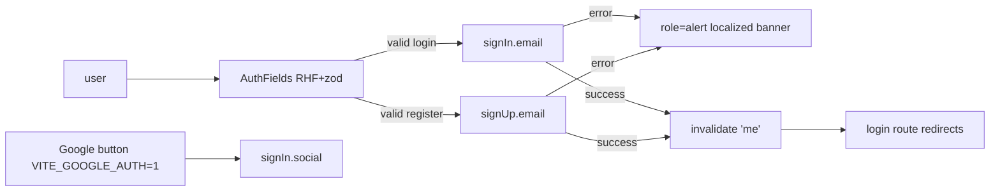

# AuthForm.tsx — AI component doc

> AI-facing sidecar for `AuthForm.tsx`. Created 2026-07-06. Keep this in sync with the code on every change.

## Purpose

The login/registration form rendered on `/login` (right column of the split —
no card, printed directly on the void with a mono weight-400 30px heading, v3):
one component for both modes with RHF + zod validation and an optional env-gated
Google button.

## What it does (for an AI reader)

- Responsibilities: collect email/password (+ name in register mode), validate via zod,
  call `signIn.email` / `signUp.email`, map server errors to localized alert copy,
  invalidate the shared `['me']` query on success.
- Public API / exports / props / endpoints: `AuthForm` (no props). Private `AuthFields`
  subcomponent remounted per mode via `key={mode}`.
- Inputs → Outputs: user keystrokes → better-auth calls → session cookie set by the API;
  UI states: idle form, submitting (button spinner), field errors (`role="alert"` per
  input), server error banner (`role="alert"`), success (session change → route redirects).
- Side effects (I/O, network, state): POST `/api/auth/sign-in/email` /
  `/api/auth/sign-up/email`; OAuth redirect via `signIn.social` (google);
  `queryClient.invalidateQueries(['me'])`.

## Dependencies

- Imports / depends on: `react-hook-form`, `@hookform/resolvers/zod`, `zod`,
  `react-i18next`, `@tanstack/react-query`, `shared/ui` (Button, Input),
  `../model/authClient`.
- Used by: `routes/login.tsx` via `modules/Auth` index.

## Diagram

## Key decisions / gotchas

- zod messages are i18n KEYS (`auth.errors.*`) translated at render — copy switches
  locale live without re-validating.
- Mode switch remounts the fields (`key={mode}`) instead of swapping the resolver on a
  live form — stale-resolver/stale-error bugs are impossible by construction.
- `noValidate` on the form: native `type=email` bubbles must not preempt zod messages.
- Server errors map through `serverErrorKeyFor` (INVALID_EMAIL_OR_PASSWORD,
  USER_ALREADY_EXISTS); raw server text is never rendered (design.md §8).
- login schema carries a no-op `name: z.string()` so both schemas infer one
  `AuthFormValues` type.
- v3 terminal restyle: h1 = `text-3xl font-normal text-white` over a white/10
  hairline (the 30px/400 heading law — no `md:` upscaling); the mode-switch
  link is portal blue (prose-link law); server banner = calm `bg-steel` block
  with a `border-glow-red` left rule + glow-red text — red marks the failure
  STATUS, the surface never turns into a red panel. Submit stays the default
  GREEN specimen pill (sign-in/sign-up = create actions per the triad); the
  Google button is the amber ghost. Behavior, roles and i18n keys untouched.

## Commits

- 1ecb2f7 2026-07-06 feat(web): api client + auth module (email/password, optional google)
- cb228e3 2026-07-07 restyle(web): editorial app shell, auth, generator, gallery
- 252ab38 2026-07-07 restyle(web): terminal design system — cosmic void tokens, jetbrains mono, specimen pills + docs
