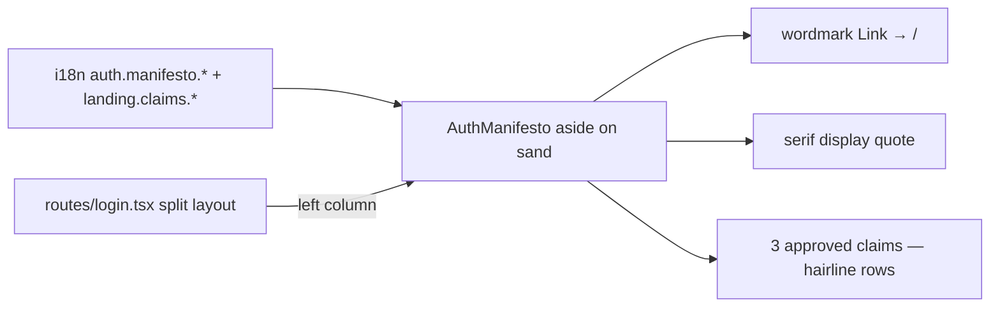

# AuthManifesto.tsx — AI component doc

> AI-facing sidecar for `AuthManifesto.tsx`. Created 2026-07-07 (stage 3 editorial
> redesign). Keep this in sync with the code on every change.

## Purpose

The left panel of the `/login` editorial split (brief: "serif quote/manifesto block on
sand background"): brand quote, wordmark escape hatch to `/`, and the three approved
claims as hairline rows on the sand tint.

## What it does (for an AI reader)

- Responsibilities: render static, localized manifesto content; give the standalone
  login screen a way back to the landing (there is no AppShell on `/login`).
- Public API / exports / props / endpoints: `AuthManifesto` (no props).
- Inputs → Outputs: i18n strings only → presentational `<aside>`; no state, no effects.
- Side effects (I/O, network, state): none. Navigation only via the typed `<Link to="/">`.

## Dependencies

- Imports / depends on: `@tanstack/react-router` (Link), `react-i18next`.
- i18n keys: `auth.manifesto.quote`, `auth.manifesto.caption`, and REUSED
  `landing.kicker` + `landing.claims.*` — the approved claims wording has exactly one
  source of truth (spec copy rule; changing a claim updates both screens at once).
- Used by: `routes/login.tsx` via the `modules/Auth` index.

## Diagram

## Key decisions / gotchas

- Claims reuse `landing.claims.*` deliberately — inventing login-only claim copy would
  create a second place where the four approved claims could drift.
- The vermillion wordmark dot is `aria-hidden`, so the link's accessible name stays
  exactly "openCreate" (tests query it by that name).
- Uppercase kicker/caption are CSS `uppercase` only — DOM text stays sentence case so
  i18n-string queries keep matching.
- `lg:min-h-screen` + `lg:justify-between` pins wordmark/quote/claims into the magazine
  column on desktop; on mobile the panel stacks above the form as a compact block.

## Commits

- cb228e3 2026-07-07 restyle(web): editorial app shell, auth, generator, gallery
