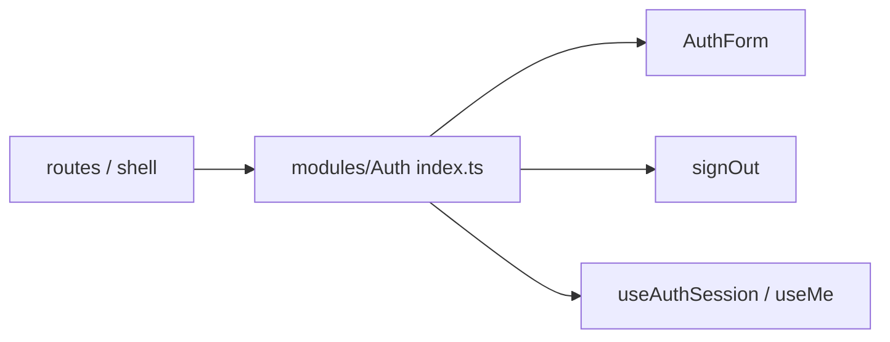

# index.ts — AI component doc

> AI-facing sidecar for `index.ts` (modules/Auth). Created 2026-07-06. Keep this in sync with the code on every change.

## Purpose

Public API of the Auth module — the only import surface other layers may use
(`import { AuthForm, useAuthSession } from 'modules/Auth'`).

## What it does (for an AI reader)

- Responsibilities: re-export the module's public pieces; keep `model/` and
  `components/` internals private (modular-architecture rule).
- Public API / exports / props / endpoints: `AuthForm`, `signOut`, `useAuthSession`,
  `useMe`.
- Inputs → Outputs: barrel only — no logic.
- Side effects (I/O, network, state): none.

## Dependencies

- Imports / depends on: `./components/AuthForm`, `./model/authClient`, `./model/useSession`.
- Used by: `routes/login.tsx`; later the AppShell (Task 18: `signOut`, `useMe`) and
  auth-guarded routes (Tasks 16-17).

## Diagram

## Key decisions / gotchas

- `signIn`/`signUp` are NOT exported: only `AuthForm` performs credential auth, so the
  flow (validation, localized errors, `['me']` invalidation) cannot be bypassed.

## Commits

- 1ecb2f7 2026-07-06 feat(web): api client + auth module (email/password, optional google)
