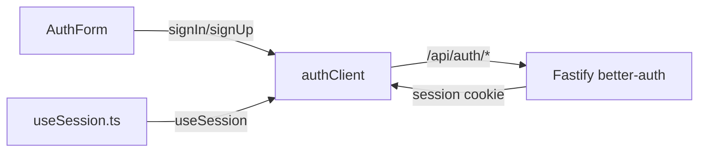

# authClient.ts — AI component doc

> AI-facing sidecar for `authClient.ts`. Created 2026-07-06. Keep this in sync with the code on every change.

## Purpose

Creates the single better-auth React client for the SPA and re-exports its auth
actions so the rest of the Auth module never imports `better-auth` directly.

## What it does (for an AI reader)

- Responsibilities: instantiate `createAuthClient()` once; expose `signIn`, `signUp`,
  `signOut`, `useSession` as the module-internal auth surface.
- Public API / exports / props / endpoints: `authClient`, `signIn` (`.email`, `.social`),
  `signUp` (`.email`), `signOut`, `useSession` (nanostore-backed React hook returning
  `{ data, isPending, error, refetch }`).
- Inputs → Outputs: auth actions POST to `/api/auth/*` (better-auth endpoints on the
  Fastify API) and return `{ data, error }`; `useSession` streams the current session.
- Side effects (I/O, network, state): HTTP calls to `/api/auth/*`; session cookie
  set/cleared by the server; internal nanostore session atom.

## Dependencies

- Imports / depends on: `better-auth/react`.
- Used by: `model/useSession.ts` (wraps `useSession` into `useAuthSession`/`useMe`),
  `components/AuthForm.tsx` (signIn/signUp), module `index.ts` (re-exports `signOut`).

## Diagram

## Key decisions / gotchas

- DELIBERATE deviation from the plan snippet: `createAuthClient({ baseURL: '/api/auth' })`
  throws `BetterAuthError: Invalid base URL` in better-auth 1.6.23 (`assertHasProtocol`
  demands absolute http(s)). Calling `createAuthClient()` resolves
  `window.location.origin` + default basePath `/api/auth` — same-origin, identical wire
  behavior through the Vite `/api` proxy.
- Tests mock THIS module (`vi.mock('../model/authClient')`), so the real client is never
  constructed in component tests.

## Commits

- 1ecb2f7 2026-07-06 feat(web): api client + auth module (email/password, optional google)
