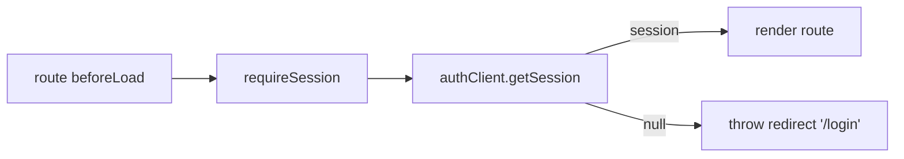

# routeGuard.ts — AI component doc

> AI-facing sidecar for `routeGuard.ts`. Created 2026-07-06. Keep this in sync with the code on every change.

## Purpose

`beforeLoad` auth guard for protected routes: resolves the better-auth session
and redirects signed-out visitors to `/login` before the screen mounts.

## What it does (for an AI reader)

- Responsibilities: one async check usable from TanStack Router `beforeLoad`.
- Public API / exports: `requireSession(): Promise<void>` — resolves when signed
  in, otherwise THROWS `redirect({ to: '/login' })`.
- Inputs → Outputs: none → void | thrown router redirect.
- Side effects: network call `authClient.getSession()` (GET /api/auth/get-session, cookie-based).

## Dependencies

- Imports: `@tanstack/react-router` (`redirect`), `./authClient` (module-internal).
- Used by: `routes/create.tsx`, `routes/library.tsx` (via `modules/Auth` public API).

## Diagram

## Key decisions / gotchas

- Guard at `beforeLoad`, not in the component: no flash of protected UI, no
  wasted queries for signed-out visitors (plan Task 16 contract).
- Lives in the Auth module so routes never import better-auth directly — the
  session provider stays swappable in one file (`authClient.ts`).
- `redirect()` must be THROWN — returning it would be ignored by the router.

## Commits

- (pending) feat(web): generator module — prompt, model/aspect/duration, i2v upload, cost
