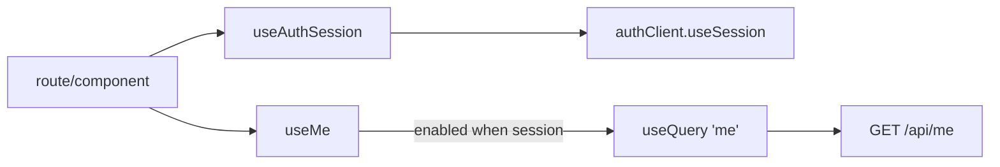

# useSession.ts — AI component doc

> AI-facing sidecar for `useSession.ts`. Created 2026-07-06. Keep this in sync with the code on every change.

## Purpose

Session and profile hooks of the Auth module: `useAuthSession` (better-auth session)
and `useMe` (ledger-accurate profile from `/api/me`).

## What it does (for an AI reader)

- Responsibilities: wrap `authClient.useSession()`; fetch `/api/me` with TanStack Query
  only when a session exists.
- Public API / exports / props / endpoints: `useAuthSession()` →
  `{ data, isPending, error, refetch }`; `useMe()` → `UseQueryResult<Me>` on key `['me']`,
  `staleTime: 30_000`, `enabled: Boolean(session.data)`.
- Inputs → Outputs: none → session state; none → `Me` (`id`, `email`, `name`,
  `creditsBalance`).
- Side effects (I/O, network, state): GET `/api/me` via `shared/libs/apiClient`;
  populates the shared `['me']` cache entry.

## Dependencies

- Imports / depends on: `@tanstack/react-query`, `@opencreate/contracts` (`Me`),
  `shared/libs/apiClient`, `./authClient`.
- Used by: `routes/login.tsx` (via module index), later AppShell (Task 18) and any
  signed-in surface needing the profile.

## Diagram

## Key decisions / gotchas

- `['me']` is deliberately the same query key Credits' `useBalance` uses — one cache
  entry for the balance, invalidated by AuthForm after login/registration.
- Balance is read from our DB via `/api/me` (ledger truth), never from the better-auth
  session payload, so charges/refunds are always reflected.
- `enabled: Boolean(session.data)` avoids a guaranteed-401 request for signed-out users.

## Commits

- _no commit yet_
