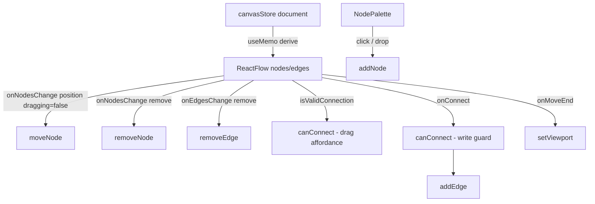

# CanvasEditor.tsx — AI component doc

> AI-facing sidecar for `CanvasEditor.tsx`. Created 2026-07-30. Keep this in sync with the code on every change.

## Purpose
The React Flow shell: the board itself, plus the palette, minimap, controls and dot background. It is the translation layer between two models — the STORE holds the document (contract-shaped nodes/edges), React Flow wants its own objects, so RF objects are derived per render and every RF change event is written back to the store.

## What it does (for an AI reader)
- Responsibilities: derive RF nodes/edges, register node types, translate drag/remove/connect/move events into store actions, enforce the edge law at drag time, host the palette and drop target.
- Public API / exports / props / endpoints: `CanvasEditor({ models: CanvasModelOption[] })` — wraps `EditorInner` in `ReactFlowProvider`.
- Inputs → Outputs: store document + catalog models → a rendered board; user gestures → `moveNode` / `removeNode` / `addNode` / `addEdge` / `removeEdge` / `setViewport`.
- Side effects (I/O, network, state): store writes only; no network. Imports the vendor stylesheet.

## Dependencies
- Imports / depends on: `@xyflow/react` (+ `dist/style.css`), `../model/edgeRules`, `../model/canvasStore`, `../model/types`, the four node components, `./NodePalette`.
- Used by: `routes/canvas.$canvasId.tsx` through the module barrel.

## Diagram

## Key decisions / gotchas
- `nodeTypes` lives at MODULE scope. Rebuilding that object per render makes React Flow re-register the types and remount every node — which in a composer canvas means losing focus on every keystroke.
- Positions are written on drag END only (`change.dragging === false`): one store write and one autosave arm per gesture instead of ~60 per second.
- `canConnect` runs TWICE by design — in `isValidConnection` it is a UI affordance (the wire refuses to snap), in `onConnect` it is the write guard. The document must never contain an edge the rules would refuse, and the two hooks fire in different situations.
- `defaultViewport` is read once from the store at mount, which is why the route waits until the store holds THIS document before rendering the board (otherwise the saved camera is lost and the previous canvas flashes).
- `onMoveEnd` marks the document dirty on every pan/zoom; the 1.5 s autosave debounce is what keeps that from becoming a PATCH storm.
- The vendor CSS import is deliberate and permitted (same standing as the font packages) — React Flow cannot draw edges without it.
- The dot grid uses `ridge` (#314062), one surface step above the steel cards, so texture reads as depth BEHIND the nodes.

## Commits
- bcb3148 2026-07-30 feat(canvas-web): editor shell, palette, library, routes

## Update 2026-07-30 — per-node RF identity cache (focus-loss fix)

- `rfNodes` now preserves PER-NODE object identity via a state-held Map
  (`rfNodeCache`, seeded once with `useState(() => new Map())` and mutated
  directly — deliberate, not a `useRef`, so the cache identity itself stays
  stable across StrictMode's double-render), returning the same RF object
  while id/kind/position/data are unchanged; deleted
  ids are evicted. **Load-bearing, not an optimization**: React Flow v12 treats a
  node object with new identity as unmeasured and hides it (`visibility: hidden`)
  for a frame until ResizeObserver answers — a focused textarea inside that node
  loses focus to `<body>` on that frame, so naive per-render rebuilding ate every
  keystroke after the first (found live 2026-07-30, one char landed per click).
- Companion fix: the editor route memoizes `models` (its identity feeds the cache
  comparison) — see `routes/canvas.$canvasId.tsx`.

## Update 2026-07-30 — drag follows the cursor (per-frame position writes)

- `onNodesChange` now applies `position` changes on EVERY drag frame, not only
  at `dragging === false`. In controlled React Flow a node moves only when the
  `nodes` prop reflects each intermediate position — the old dragEnd-only write
  left the card frozen under the cursor and teleporting on drop (owner report).
- Cost analysis: per-frame store writes are cheap (the rfNodes identity cache
  rebuilds only the dragged node's RF object), and autosave still PATCHes once
  per gesture — the debounce arms on the saved→dirty TRANSITION, so sixty dirty
  writes ride one timer.
