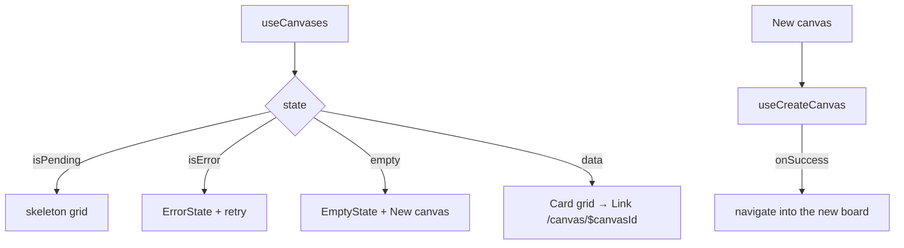

# CanvasLibrary.tsx — AI component doc

> AI-facing sidecar for `CanvasLibrary.tsx`. Created 2026-07-30. Keep this in sync with the code on every change.

## Purpose
The body of `/canvas`: the user's canvases as a card grid, with the create action. Implements the 4-states rule end to end (skeletons → error+retry → empty+CTA → grid), mirroring `CinemaLibrary` so the two libraries read as one product.

## What it does (for an AI reader)
- Responsibilities: fetch and render the list, own its four states, create a canvas and navigate into it.
- Public API / exports / props / endpoints: `CanvasLibrary()` — no props; uses `GET /api/canvases` and `POST /api/canvases`.
- Inputs → Outputs: the canvases query → cards linking to `/canvas/$canvasId`; the create button → a new canvas, then a redirect into its editor.
- Side effects (I/O, network, state): two network calls (via `../model/api`) and one navigation.

## Dependencies
- Imports / depends on: `react-i18next`, `@tanstack/react-router` (`Link`, `useNavigate`), `shared/ui` (`Button`, `Card`, `EmptyState`, `ErrorState`, `Skeleton`), `useCanvases`/`useCreateCanvas` from `../model/api`.
- Used by: `routes/_shell.canvas.index.tsx`.

## Diagram

## Key decisions / gotchas
- Creating asks for nothing: a canvas has no settings to choose up front (unlike a film, which needs an aspect ratio), so the flow is create → open, and renaming happens inline in the editor header. The title defaults to the localized `canvas.untitled`.
- The header renders in all four states, so the create action never disappears while the list is loading or broken.
- The whole card is the `Link` and the hover lift lives on the link, leaving `Card`'s surface styling untouched — the `FilmCard` precedent.
- The "updated" caption reuses `cinema.card.updated` rather than duplicating the string; both libraries mean exactly the same thing by it.
- Deletion is not wired here yet (`useDeleteCanvas` exists in the API layer for it) — it needs a confirm surface, which lands with the phase-3 UI pass.

## Commits
- bcb3148 2026-07-30 feat(canvas-web): editor shell, palette, library, routes
