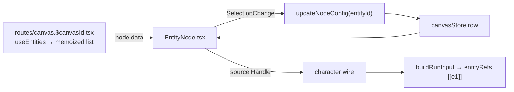

# EntityNode.tsx — AI component doc

> AI-facing sidecar for `EntityNode.tsx`. Created 2026-07-30. Keep this in sync with the code on every change.

## Purpose
The **character node** (ADR `canvas-mode` phase 3, spec §3–4): a compact card that names ONE Soul character and feeds it to whatever it is wired into. It is the only generation-adjacent node that never runs — it holds no prompt, no model, no price and no version history, so its job is entirely "make *which character* unmistakable at a glance".

## What it does (for an AI reader)
- Responsibilities: read its own row from the store by id; render the character picker over the route-injected library; write the chosen `entityId` into `config`; render the empty-library state; expose an OUTPUT port only.
- Public API / exports / props: `EntityNode({ id, data })` where `data: EntityNodeData = { entities: CanvasEntityOption[] }` (React Flow hands the node its id + data). Registered as `character` in `CanvasEditor`'s module-scope `nodeTypes`.
- Inputs → Outputs: store row + character library → a card; a pick → `updateNodeConfig(id, { entityId })` → the document turns dirty → autosave PATCHes it. The RUN side is not here: the consumer node reads this `entityId` through `findCharacterParent` / `buildRunInput` and sends it as `entityRefs`.
- Side effects: one store write per pick. No network, no polling, no money.

## Dependencies
- Imports / depends on: `@tanstack/react-router` (`Link` for the empty-state hint), `react-i18next`, `shared/ui` (`Select`, `WELL_SURFACE`), `../model/types` (`CanvasEntityOption`), `../model/canvasStore`, `./NodeShell`.
- Used by: `CanvasEditor` via `nodeTypes.character`. Never exported from the module barrel (nodes are internal to the board).
- Consumed downstream by: `model/useNodeGeneration.ts` — `findCharacterParent` reads the `entityId` this card writes.

## Diagram

## Key decisions / gotchas
- **`status="idle"` is passed explicitly** rather than teaching `NodeShell` a fifth "statusless" mode: a character never runs, so its status ladder collapses to the first rung, and the board keeps ONE status vocabulary.
- **Output port only** (`hasInput={false}`): nothing feeds a character. `edgeRules` already agrees — `character` is absent from `MEDIA_TARGET_KINDS` and only appears as a source in the entity slot.
- **The face sits BESIDE the picker, not above it.** The `Select` trigger already prints the chosen name, so a separate name line printed the same word twice inside a 288px card (caught by the test that then found two "Bear" nodes). The final layout states each of the spec's three elements exactly once: avatar (the plate), name (the trigger), "from Soul" (the picker's caption, `canvas.node.fromSoul`).
- **The picker stays after a pick** — recasting a chain is a normal edit, not a rebuild.
- **Empty library is a real state, not an empty dropdown** (4-states law applied inside a node): `role="status"` copy plus a `Link` to `/soul`. The `Link` carries `nodrag`, or React Flow starts panning the board from the pointer-down and the click never lands.
- The hint's condition is `entities.length === 0`, which is also true for the instant the `['entities']` query is in flight — the same shape `ImageNode` has with `models` (an empty picker while the catalog loads). Accepted rather than plumbing an `isPending` flag through node data, which would add a field to the RF cache key for a sub-second window.
- A `chosen` entity that is missing from the library (deleted after it was wired) renders the placeholder, and the run fails server-side with "unknown entity" — deliberately not given its own copy, because the recovery is the same pick either way.
- A character with no photo keeps the plate's box and shows a `☺` glyph (`aria-hidden`) — the row must not change height the moment a face lands, and the name is never icon-only.

## Commits
- 87c6d3c 2026-07-30 feat(canvas-web): character node — a Soul character as a wired reference
