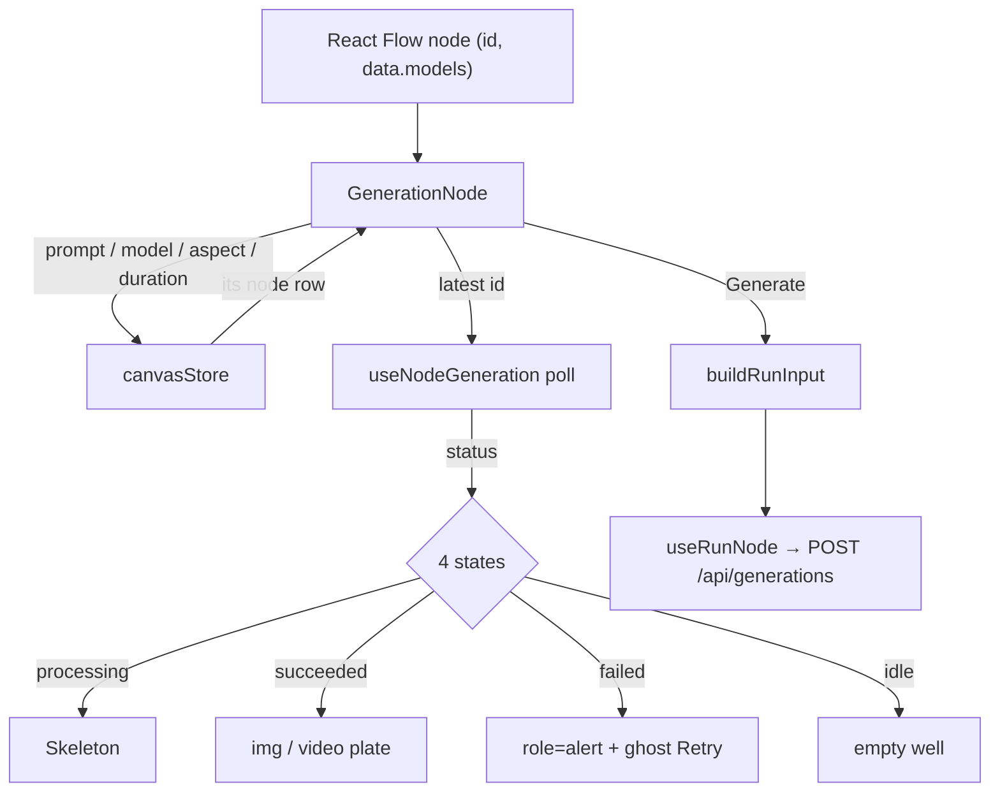

# ImageNode.tsx — AI component doc

> AI-facing sidecar for `ImageNode.tsx`. Created 2026-07-29. Keep this in sync with the code on every change.

## Purpose
The image node AND the shared generation body both image and video nodes render. It is a mini-composer on a card: preview (4 states), version stepper, prompt, model/aspect/duration pickers, Generate. It reads its own row from the store by id, because React Flow hands a node component only `id` and `data`.

## What it does (for an AI reader)
- Responsibilities: render the node's 4 UI states off the shown version's poll; own the composer controls; reconcile config when the model changes; submit the run; gate Generate on the wired media parent's SUCCEEDED status (C2); show progress % while processing (I5); lead a failed state with localized copy + a refunded chip, never raw provider text (C3/C4).
- Public API / exports / props / endpoints: `ImageNode({ id, data })` (React Flow node type `image`), `GenerationNode({ id, data, kind })` (shared body, imported by `VideoNode` only), `GenerationNodeData` = `{ models: CanvasModelOption[] }`.
- Inputs → Outputs: node id + catalog models → a composer card; edits → `updateNodeConfig`; Generate → `useRunNode.mutate(buildRunInput(...))`.
- Side effects (I/O, network, state): store writes; the run mutation and the generation poll (both via `../model/useNodeGeneration`); the enhance mutation behind the sparkle (`POST /api/prompt/enhance`, owned by `shared/ui`'s `EnhanceButton`); a SECOND `useNodeGeneration` subscription on the wired media parent's latest generation id, purely to keep that entry fresh in the shared TanStack Query cache and to re-render this node when it changes; synchronous `queryClient.getQueryData` reads to build the status snapshot `buildRunInput` needs.

## Dependencies
- Imports / depends on: `react`, `react-i18next`, `@tanstack/react-query` (`useQueryClient`), contract types (incl. `Generation`), `shared/ui` (`Badge`, `Button`, `EnhanceButton`, `Select`, `Skeleton`, `WELL_SURFACE`), `shared/libs/errorCopy` (`errorCodeMessageKey`), `../model/types`, `../model/canvasStore`, `../model/useNodeGeneration` (`buildRunInput`, `findCharacterParent`, `findMediaParent`, `useNodeGeneration`, `useRunNode`), `./NodeShell`, `./VersionStrip`.
- Used by: `CanvasEditor`'s `nodeTypes` map (`image`), `VideoNode` (shared body).

## Diagram

## Key decisions / gotchas
- The 4-states rule is implemented against the POLL, not against local flags — the card can never claim "done" while the server still says processing.
- `versionIndex` is `null` by default, meaning "follow the latest"; stepping back parks it, and SUBMIT clears it inside the click handler. No effect repairs state after the fact (the react-hooks/set-state-in-effect rule and plain correctness both want this).
- Changing the model reconciles aspect and duration IN THE SAME edit (`handleModelChange`): models expose different ratio/duration sets, and a stale value would either 400 at the API or silently bill the wrong duration.
- A fresh node has an EMPTY config, so the aspect picker exists to keep the run legal: the API requires an aspect ratio for image and video models. The plan's original node had no aspect control at all — every canvas run would have failed validation.
- ONE price on the card, on the model control (`Select`'s `meta`), computed with `creditsFor(model, duration)`: a video model prices per duration, so advertising the flat baseline while a longer clip is selected would show a number the user is not charged.
- Uses the kit `Select`, not a native `<select>`: design.md §6 gives the app exactly one dropdown, and its rich rows (name · provider · price) are what make model choice legible in a 288px card.
- Every control carries `nodrag` — without it React Flow starts a canvas pan/drag from the field.
- `if (!node) return null` sits AFTER every hook call, so hook order stays stable when a node is deleted mid-render.
- **C2 fix-wave correction.** `buildRunInput` originally cited a media parent's bare LAST history id with no status check — a child could cite a still-processing or failed run. This component now finds the media parent (`findMediaParent`), actively polls its LATEST generation id (`useNodeGeneration(parentLatestId)` — the return value is unused; the call exists purely so THIS component holds a live subscription and re-renders the instant that id's status changes, since a plain `getQueryData` read in render does not subscribe to anything), and builds a `{ id: status }` snapshot for every id in the parent's history via `queryClient.getQueryData`. That snapshot is what `buildRunInput` uses to pick the newest SUCCEEDED id (or return `null`).
- **C3/C4 fix-wave correction.** The failed state used to render raw `generation.errorMessage` as the ONLY copy (design.md §9 violation — raw server text must never lead) and had no refund indicator despite the charge always being refunded server-side on failure. It now mirrors `GenerationCard.tsx`: primary line is `t(errorCodeMessageKey(generation?.errorCode))`; the raw `errorMessage` may follow as a quiet secondary line EXCEPT for `content_blocked` (moderation strings are not user copy); a `Badge variant="success"` says `canvas.node.refunded`. The `canvas.node.failedPreview` i18n key was removed (orphaned by this change, no other caller).
- **I5 fix-wave addition.** `generation.progress` (0–100 while processing) is now passed down to `NodeShell`'s new `progress` prop, which appends `· {progress}%` next to the amber status word — mirrors `ShotClipStatus.tsx`. Previously the processing state was a bare `Skeleton` with no numeric feedback.
- **The prompt field carries the enhance sparkle** (owner requirement 2026-07-30, mandatory on EVERY node prompt field). `EnhanceButton` from `shared/ui`, wired to `config.prompt` in BOTH directions: `value` is the document text and `onEnhanced` is the same `updateNodeConfig` a keystroke uses — so the enhanced prompt is what autosave persists and what `buildRunInput` submits. Local component state here would have shown one prompt and paid for another. Two placement rules, both load-bearing: (1) the absolute positioning lives on a WRAPPER div, never on `EnhanceButton`'s `className` — that class lands on the component's own `relative` box, Tailwind resolves competing position utilities by stylesheet order rather than class order, and that box is the anchor its error/nudge chip (`absolute bottom-full`) hangs from (the `ShotInspector` precedent does the same); (2) `nodrag` on the wrapper AND on the button, because React Flow's drag hit test (`hasSelector`) walks ancestors up to the node element — without it a pointer-down on the sparkle would pan the board instead of enhancing. The textarea gains `pr-10` so text never slides under the icon.
- **Character wire (phase 3a) narrows the model list.** A wired character costs a reference slot, and a model with no `referenceMode` is refused by the API with a clean 400 before any charge. While `findCharacterParent` reports a wire, the picker lists only reference-capable models (the `ModelSelect` precedent: filter the affordance, let the API decide). If the node still points at a model chosen BEFORE the wire existed, `blockedByModel` shows the amber `canvas.node.characterModelHint` line and `canRun` gates both Generate and the failed-state Retry — amber because nothing has failed, the graph and the model merely disagree and the way out is one pick away. The condition is deliberately precise ("the model exists in the catalog AND lacks the capability"), so a `modelId` matching nothing at all — a stale document, not a capability problem — does not borrow that message.

## Commits
- f7268e3 2026-07-30 feat(canvas-web): node components — image/video/upload/note, version strip
- (fix-wave) fix(canvas): C2/C3/C4/I5 — gate on succeeded parent status, localized failure copy + refunded chip, processing progress %
- 87c6d3c 2026-07-30 feat(canvas-web): character node — a Soul character as a wired reference
