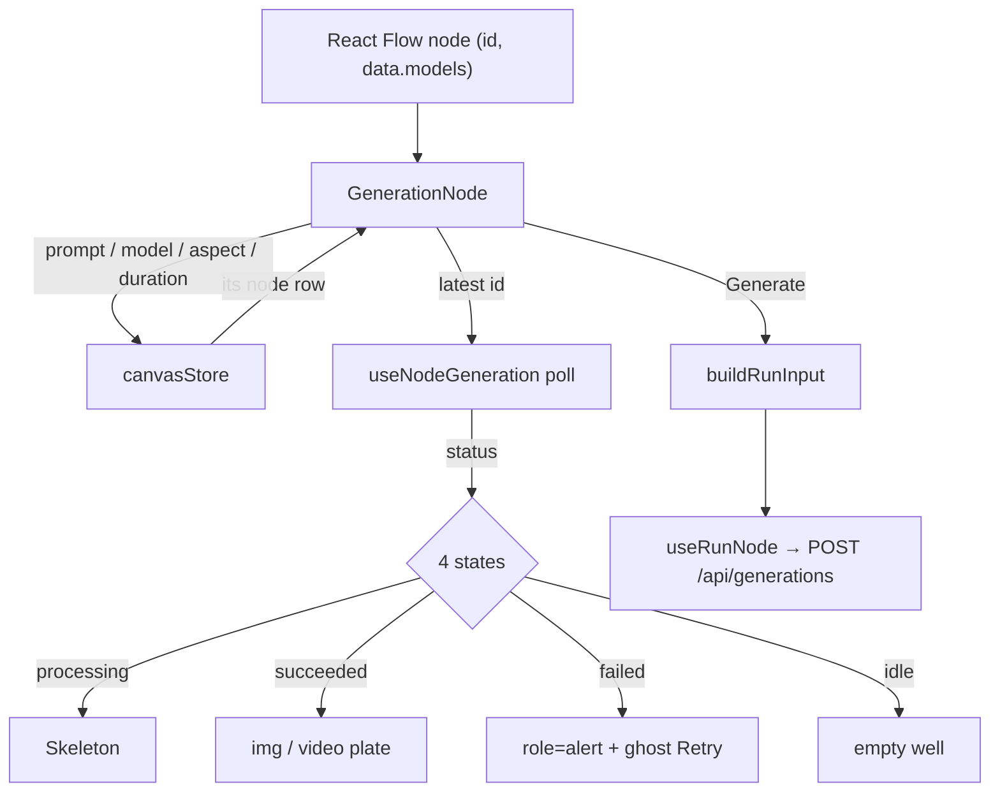

# ImageNode.tsx — AI component doc

> AI-facing sidecar for `ImageNode.tsx`. Created 2026-07-29. Keep this in sync with the code on every change.

## Purpose
The image node AND the shared generation body both image and video nodes render. It is a mini-composer on a card: preview (4 states), version stepper, prompt, model/aspect/duration pickers, Generate. It reads its own row from the store by id, because React Flow hands a node component only `id` and `data`.

## What it does (for an AI reader)
- Responsibilities: render the node's 4 UI states off the shown version's poll; own the composer controls; reconcile config when the model changes; submit the run.
- Public API / exports / props / endpoints: `ImageNode({ id, data })` (React Flow node type `image`), `GenerationNode({ id, data, kind })` (shared body, imported by `VideoNode` only), `GenerationNodeData` = `{ models: CanvasModelOption[] }`.
- Inputs → Outputs: node id + catalog models → a composer card; edits → `updateNodeConfig`; Generate → `useRunNode.mutate(buildRunInput(...))`.
- Side effects (I/O, network, state): store writes; the run mutation and the generation poll (both via `../model/useNodeGeneration`).

## Dependencies
- Imports / depends on: `react`, `react-i18next`, contract types, `shared/ui` (`Button`, `Select`, `Skeleton`, `WELL_SURFACE`), `../model/types`, `../model/canvasStore`, `../model/useNodeGeneration`, `./NodeShell`, `./VersionStrip`.
- Used by: `CanvasEditor`'s `nodeTypes` map (`image`), `VideoNode` (shared body).

## Diagram

## Key decisions / gotchas
- The 4-states rule is implemented against the POLL, not against local flags — the card can never claim "done" while the server still says processing.
- `versionIndex` is `null` by default, meaning "follow the latest"; stepping back parks it, and SUBMIT clears it inside the click handler. No effect repairs state after the fact (the react-hooks/set-state-in-effect rule and plain correctness both want this).
- Changing the model reconciles aspect and duration IN THE SAME edit (`handleModelChange`): models expose different ratio/duration sets, and a stale value would either 400 at the API or silently bill the wrong duration.
- A fresh node has an EMPTY config, so the aspect picker exists to keep the run legal: the API requires an aspect ratio for image and video models. The plan's original node had no aspect control at all — every canvas run would have failed validation.
- ONE price on the card, on the model control (`Select`'s `meta`), computed with `creditsFor(model, duration)`: a video model prices per duration, so advertising the flat baseline while a longer clip is selected would show a number the user is not charged.
- Uses the kit `Select`, not a native `<select>`: design.md §6 gives the app exactly one dropdown, and its rich rows (name · provider · price) are what make model choice legible in a 288px card.
- Every control carries `nodrag` — without it React Flow starts a canvas pan/drag from the field.
- `if (!node) return null` sits AFTER every hook call, so hook order stays stable when a node is deleted mid-render.

## Commits
- f7268e3 2026-07-30 feat(canvas-web): node components — image/video/upload/note, version strip
