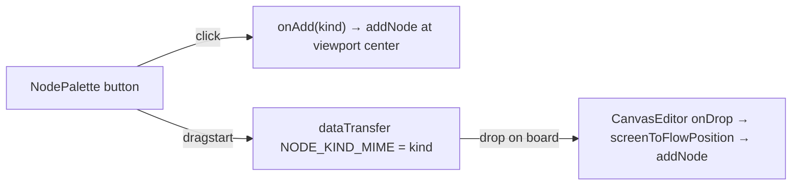

# NodePalette.tsx — AI component doc

> AI-facing sidecar for `NodePalette.tsx`. Created 2026-07-30. Keep this in sync with the code on every change.

## Purpose
The left rail of the editor: one button per node kind this phase ships. Each button is both a drag source (drop it where you want the node) and a click target (drops it at the viewport center) — the click path exists because HTML drag-and-drop is not keyboard-reachable, and a canvas that can only be built with a mouse is not accessible.

## What it does (for an AI reader)
- Responsibilities: list the available kinds, start a drag carrying the kind, or ask the parent to add one.
- Public API / exports / props / endpoints: `NodePalette({ onAdd: (kind: CanvasNodeKind) => void })`, `NODE_KIND_MIME`.
- Inputs → Outputs: a click → `onAdd(kind)`; a drag → `dataTransfer[NODE_KIND_MIME] = kind`, which `CanvasEditor`'s `onDrop` reads.
- Side effects (I/O, network, state): none beyond writing the drag payload.

## Dependencies
- Imports / depends on: `react-i18next`, `CanvasNodeKind` from `@opencreate/contracts`.
- Used by: `CanvasEditor`.

## Diagram

## Key decisions / gotchas
- A CUSTOM mime type (`application/x-opencreate-node-kind`), not `text/plain`: the board's `onDragOver` only calls `preventDefault()` when that type is present, so dragging a file or selected text over the canvas is left alone instead of being swallowed.
- Glyphs are `aria-hidden` decoration; the localized label is the accessible name. Never icon-only (design.md §8).
- The palette lists only the kinds the phase can actually USE — `upscale` and `remove-bg` exist in the contract and in `edgeRules` already, but adding a button for a node that cannot do anything would be a promise the product does not keep yet. `character` joined the rail with ADR phase 3a, the moment it could pick a real Soul character and feed it downstream.
- Rail order follows the shape of a chain rather than the contract's enum order: what produces media (image · video · upload), then what identifies a subject (character), then the annotation that never runs (note).
- Buttons hit `min-h-10` for the touch-target rule even though the rail is pointer-first.

## Commits
- bcb3148 2026-07-30 feat(canvas-web): editor shell, palette, library, routes
